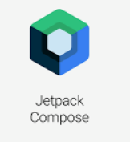
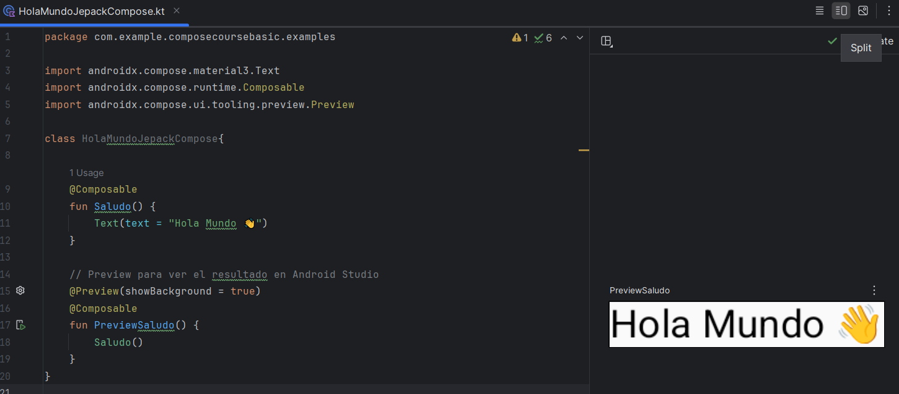

# 🚀 Introducción Jetpack Compose - EcoEat

- [Volver al inicio](../README.md) 🧩

---

## Introducción

Quizás muchos de ustedes vienen de trabajar con Android clásico (XML) 📄,  
algunos quizás nunca han trabajado con Android 😅.

La idea de este tutorial es crear una aplicación **desde el diseño hasta la implementación**, incluso aplicando algún patrón de arquitectura. Primero conoceremos bien las bases de **Jetpack Compose 💻** y luego iremos madurando este proyecto 🌱 para ponerlo en práctica ✨.


Jetpack Compose no es el futuro, es **el presente de Android 🚀📱**. Actualmente entre el 10% y 15% de las aplicaciones en Play Store 🛒 ya están escritas en Compose 😱🔥.

Exploraremos:

- Qué nos ofrece Compose 💡
- Su enfoque multiplataforma 🌍
- Nuevas características y buenas prácticas 🧭

---

## Kotlin y desarrollo nativo

Trabajaremos con **Kotlin ☕** y desarrollo nativo Android 🤖.  
Otras alternativas multiplataforma: Flutter 🐦, React Native ⚛️, Xamarin/Maui 🧱.

¿Por qué Kotlin?

En este proyecto vamos a utilizar **Kotlin**, y lo hacemos principalmente por tres razones clave 🔑 que lo hacen ideal para el desarrollo moderno en Android:


### 1️⃣ Expresivo y conciso ✂️

- Kotlin permite escribir **menos código 📝**, pero más legible y mantenible.

**Ejemplo práctico:**

```text
// Java
TextView textView = findViewById(R.id.textView);
textView.setText("Hola Mundo");

// Kotlin
textView.text = "Hola Mundo"
```

- Como se ve, con Kotlin logramos el mismo resultado con mucho menos código, más limpio y fácil de entender.

### 2️⃣ Código seguro 🛡️ (Null Safety)

- Uno de los problemas más comunes en Android (y Java) son los **`NullPointerException`** 💥.

- Kotlin introduce **null safety**, que obliga a declarar cuándo una variable puede ser `null` y cuándo no, reduciendo la probabilidad de errores críticos ⚠️.

**Ejemplo:**

```kotlin
var nombre: String = "Juan"   // No puede ser null
var apellido: String? = null  // Puede ser null
```

- Si intentamos usar una variable que puede ser null sin verificarla, Kotlin nos marcará un warning ⚠️ o error durante la compilación.

- Esto significa que muchos errores que antes aparecían en tiempo de ejecución 😱 ahora los detectamos antes de correr la app ✅, aumentando la estabilidad y confiabilidad de nuestro código.

### 3️⃣ Interoperabilidad 🌐

- Kotlin es 100% interoperable con Java ☕, lo que significa que podemos usar todas las librerías y clases de Java dentro de nuestro proyecto Android 📱 sin problemas.

- Esto facilita migrar proyectos existentes, mezclar código y aprovechar todo el ecosistema de Android de manera fluida ✅.

**Ejemplo:**

```kotlin
// Usando una clase de Java en Kotlin
val date = java.util.Date()
println("Fecha actual: $date")
```

- Gracias a esta interoperabilidad, podemos combinar lo mejor de ambos mundos: la seguridad y concisión de Kotlin junto con la robustez y madurez de Java.

---

## 🧩 ¿Qué es Jetpack Compose?



Jetpack Compose es un **kit de herramientas 🧰 para construir interfaces nativas** 🎨🖥️ de forma **declarativa 📜**. Esto significa que, en lugar de describir _cómo_ se debe dibujar cada elemento en pantalla, simplemente describes _qué_ quieres que aparezca y Compose se encarga del resto.

- XML 📄 sigue siendo muy relevante: alrededor del 90% de las apps todavía lo usan. ❌
- Jetpack Compose 🧩 está creciendo rápidamente: ya cubre el 10% y se espera que sea el futuro 🚀.
- Compose es **interoperable con XML**, por lo que puedes combinar ambos enfoques.

**Ventaja clave:** Compose simplifica enormemente el trabajo y es cada vez más solicitado en el mundo laboral . Tener experiencia en Compose además de XML es un **plus para nuestro currículum ➕**.

---

## 📱 Plataformas compatibles con Jetpack Compose

Jetpack Compose no se limita a Android:

- **Móvil 📱**: completamente productivo
- **Escritorio 🖥️**: ya se puede usar en producción
- **Web 🌐**: actualmente en beta, pero en camino a producción
- **Wearables ⌚**: también listo para usar

🎯 **Foco del aprendizaje:** dominar Compose para **todas las plataformas posibles** 🌍💻📱⌚

---

## ⚙️ Kotlin Multiplatform (KMP)


Antes conocido como **KMM**, ahora llamado **Kotlin Multiplatform 💥**, permite **compartir la lógica del negocio** entre diferentes plataformas, evitando duplicar código.

### Problema con apps nativas

Si quieres desarrollar para Android y iOS de manera nativa:

1. Necesitas un proyecto en Kotlin para Android
2. Otro proyecto en Swift para iOS

😩 Esto genera mucho trabajo y duplicación.

### Ventajas de KMP

Con KMP 🌐:

- Un solo proyecto con un solo lenguaje 💻
- Compartes **core del negocio, reglas y llamadas a APIs** ✅
- Solo la interfaz se desarrolla nativamente:
  - Jetpack Compose para Android 📱
  - SwiftUI para iOS 🍏

**Resultado:** más eficiencia y menos duplicación de código

---

## 🔬 Estado de desarrollo y versiones

Cuando se lanza una nueva tecnología, pasa por estas etapas:

1. **Experimental** 🧪
2. **Alpha** ⚗️
3. **Beta** 🧪
4. **Producción** 🏁

Actualmente:

- Jetpack Compose: **Productivo ⚙️**
- KMP: **Beta 🧪**, se espera producción pronto 🚀

---

## 🔮 Futuro: Compose + Kotlin Multiplatform (KMP)

Si pensamos en el futuro de las apps multiplataforma 🌍:

- KMP se basa en **Compose**, no en XML 📄❌
- La idea es **usar Compose para toda la UI 🎨** y Kotlin para **toda la lógica compartida 🧩**
- Beneficios:
  - Una sola base de código
  - Diseño unificado para Android 📱 y iOS 🍏
  - Lógica de negocio compartida y fácil de mantener

---

## ⚖️ Flutter vs Kotlin Multiplatform


Comparando **Flutter 💙** y **KMP**:

- Flutter: rápido ⚡, excelente documentación 📚, muchos widgets listos
- KMP: flexibilidad, cercanía al entorno nativo Android/iOS 🧩, fácil de compartir código base

Ejemplo: si creas una app para iPad 🍎 que use el Apple Pencil ✏️:

- Con KMP: toda la lógica en Kotlin 💻, solo la UI específica en Swift 🍏
- Con Flutter: necesitas librerías nativas o integrar código nativo manualmente 😩

En resumen:

> Kotlin Multiplatform = flexibilidad + código compartido 💪  
> Flutter = rapidez + ecosistema de widgets ⚡

---

## 🧩 Ktor: APIs en Kotlin


Otra herramienta interesante: **Ktor ⚙️**, un framework en Kotlin 💻 para crear APIs.  
Ejemplo práctico: puedes hacer llamadas a una base de datos MySQL 🐘 usando **solo Kotlin** 💪

Actualmente, **Spring Boot 🍃 + Kotlin** también es muy popular y es fácil crear proyectos desde el IDE con Kotlin como lenguaje principal

---

## 🤔 Paradigmas de programación: Imperativo vs Declarativo

Cuando hablamos de **Jetpack Compose**, es importante entender el cambio de paradigma:

- **Imperativo ⚙️**: cómo trabajábamos con XML, donde le dices al programa **paso a paso qué hacer**.
- **Declarativo 💫**: como Compose, donde le dices al programa **qué resultado final quieres**, y él se encarga de los pasos.

---

### 📘 Programación Imperativa

El paradigma imperativo te dice **exactamente cómo hacer las cosas**.  
Es decir, debes indicarle **cada paso** a tu programa 📋.

💡 **Ejemplo no programático:**  
Imagina que quieres preparar un sándwich 🥪.  
Si lo hacemos de forma imperativa:

1️⃣ Tomas dos rebanadas de pan
2️⃣ Untas mantequilla sobre una rebanada  
3️⃣ Colocas jamón y queso  
4️⃣ Cierras el sándwich con la otra rebanada de pan  
5️⃣ Cortas el sándwich por la mitad

¡Estás describiendo cada paso que se debe hacer! Eso es **programación imperativa** 🧩

---

### 🔄 Programación Declarativa

En **declarativo**, no le dices a tu programa **cómo** hacer cada paso, sino **qué resultado final quieres** 🎯.

💡 **Ejemplo no programático:**  
Quieres un sándwich listo para comer 🥪🍽️.

> “Quiero un sándwich con jamón y queso, cortado por la mitad, servido en un plato.”

El “cocinero” (el programa) se encarga de **cómo preparar el sándwich**, qué pasos seguir y en qué orden

No te preocupas por cada acción individual, solo defines el **resultado esperado**.

---

💡 **Resumen:**

- Imperativo: describes **cómo** hacer cada paso 📋
- Declarativo: describes **qué quieres lograr** 🎯
- Jetpack Compose funciona de manera **declarativa**, así que aprender a pensar así es clave

---

## 🎨 ¿Qué es Material Design?

**Material Design** es un sistema de diseño creado por Google para construir **interfaces visuales coherentes, atractivas y funcionales** en apps y web 🌐📱💻.


En pocas palabras, es un conjunto de **principios, guías y componentes visuales** que ayudan a los desarrolladores y diseñadores a crear aplicaciones que se vean bien y sean fáciles de usar.

---

### 🔹 Principios clave de Material Design

1. **Superficies y sombras 🖼️**

   - Todo se construye sobre “capas” o superficies que tienen **profundidad y sombras**, para indicar jerarquía e interacción.

2. **Colores y tipografía 🎨✍️**

   - Material Design define **paletas de colores**, tipografías y tamaños de fuente consistentes para mantener la armonía visual.

3. **Movimiento y animaciones 🔄✨**

   - Las transiciones y animaciones comunican **fluidez** y ayudan al usuario a entender cambios en la interfaz.

4. **Componentes listos para usar 🧩**
   - Botones, tarjetas, barras de navegación, diálogos y mucho más, todos **predefinidos y personalizables**.

---

### 🔹 Material Design en Jetpack Compose

Jetpack Compose tiene soporte completo para **Material Design** mediante **librerías y componentes listos**.

Por ejemplo:

```kotlin
import androidx.compose.material3.Button
import androidx.compose.material3.Text
import androidx.compose.runtime.Composable

@Composable
fun BotonEjemplo() {
    Button(onClick = { /* acción al hacer clic */ }) {
        Text("¡Presióname!")
    }
}
```

Aquí usamos un Button de Material Design con Compose.

No necesitamos XML ni estilos complicados: Compose ya aplica las guías de Material Design automáticamente.

💡 **Ventajas de usar Material Design con Compose:** - UI consistente y moderna sin esfuerzo ✨ - Componentes listos y personalizables 🧩 - Integración directa con temas, colores y tipografía definidos por Material Design 🎨 - Facilidad para crear interfaces adaptables y accesibles ♿

> En resumen: Material Design + Jetpack Compose te permite crear apps visualmente atractivas, consistentes y modernas con mucho menos código y más productividad 💪📱💻.

---

# 👨‍💻 Creando nuestro primer Composable: Hola Mundo

Para empezar con **Jetpack Compose**, primero creamos una clase Kotlin dentro de nuestra carpeta `kotlin + java` en el proyecto de Android Studio.  
Yo la llamé:

HolaMundoJetPackCompose.kt

🔹 **Código completo**

```kotlin
package com.example.composecoursebasic.examples

import androidx.compose.material3.Text
import androidx.compose.runtime.Composable
import androidx.compose.ui.tooling.preview.Preview

class HolaMundoJepackCompose{

    @Composable
    fun Saludo() {
        Text(text = "Hola Mundo 👋")
    }

    // Preview para ver el resultado en Android Studio
    @Preview(showBackground = true)
    @Composable
    fun PreviewSaludo() {
        Saludo()
    }
}
```

🔹 **Explicación línea por línea**

> package com.example.composecoursebasic.examples

Define el paquete donde está tu clase.Permite organizar el código y evitar conflictos de nombres.

> import androidx.compose.material3.Text

Importa la **función Text**, que es la forma declarativa de mostrar texto en pantalla. Es equivalente a un **TextView en XML**, pero mucho más simple y limpio.

> import androidx.compose.runtime.Composable

Importa la anotación @Composable, obligatoria para todas las funciones que dibujan UI.

> import androidx.compose.ui.tooling.preview.Preview

Importa @Preview, que nos permite ver el Composable en la vista previa de Android Studio sin ejecutar la app. Pulsando en split y actualizando podremos ver el resultado del Hola Mundo:



> class HolaMundoJepackCompose { ... }

Creamos una clase contenedora para nuestras funciones Composable. No es obligatorio tener una clase, pero ayuda a organizar el código.

> 🔹 **Función Saludo()**

```kotlin
@Composable
fun Saludo() {
    Text(text = "Hola Mundo 👋")
}
```

@Composable indica que la función puede dibujar UI. Text(text = "Hola Mundo 👋") muestra el texto en pantalla. Aquí no necesitamos XML ni findViewById; Compose se encarga de todo automáticamente.

En Kotlin, **fun** se utiliza para declarar una **función**.

> 🔹 **Función PreviewSaludo()**

```kotlin
@Preview(showBackground = true)
@Composable
fun PreviewSaludo() {
    Saludo()
}
```

@Preview(showBackground = true) permite ver la función en la pestaña Preview de Android Studio. @Composable es necesario porque estamos dibujando UI. Dentro llamamos a Saludo() para mostrar nuestro "Hola Mundo".

---

## ✨ Reflexión final

¡Felicidades! 🎉  
Has completado el capítulo introductorio de **Jetpack Compose**.

En este capítulo aprendimos:

- La diferencia entre **programación imperativa y declarativa** 🧠
- Qué es **Jetpack Compose** y por qué es el presente de Android 🚀
- Cómo usar **Material Design** en Compose 🎨
- Cómo crear un **Composable básico de Hola Mundo** con **Preview** 👋
- La importancia de **Kotlin y Kotlin Multiplatform (KMP)** para compartir lógica entre plataformas 🌍
- Una introducción a **Ktor** para construir APIs en Kotlin ⚙️

Ahora ya tienes las bases para empezar a construir tus primeras interfaces de manera declarativa y moderna, usando **Jetpack Compose**. 💻✨

> Recuerda: lo importante es practicar. Repite los ejemplos, prueba modificar el código y comienza a familiarizarte con este nuevo enfoque de desarrollo.

---

## 📚 Recursos y enlaces útiles

- [Código de ejemplo: Hola Mundo JetPack Compose](../ejemplos/Capitulo-01/HolaMundoJepackCompose.kt) 🧩
- [Material Design](https://material.io/) 🎨
- [Ktor - Framework para APIs en Kotlin](https://ktor.io/) ⚙️
- [Kotlin Multiplatform (KMP)](https://kotlinlang.org/docs/multiplatform.html) 🌐

---

## 💡 Próximos pasos

En el **Capítulo 2** entraremos de lleno al diseño visual en Compose.  
Aprenderemos a construir **interfaces completas** y a entender cómo se **organizan los componentes en pantalla**.

🔹 Veremos cómo hacerlo con:

- 🧱 **Column, Row y Box**, los contenedores mágicos de Compose 💫
- 🖼️ Cómo **insertar imágenes** y **mostrar texto** de forma más avanzada
- 🔘 Cómo **añadir botones** e **interactuar con ellos**
- 🎨 Cómo combinar y alinear todos estos elementos para formar diseños reales

Además, haremos **una batería de ejercicios prácticos** para reforzar estos conceptos fundamentales, y veremos nuestras **previews en Android Studio** 📱 en formato de teléfono, para observar los resultados en tiempo real.

> Estos conceptos son la base de todo lo que haremos más adelante, así que los trabajaremos paso a paso con ejemplos visuales y prácticos 💡
