# 🧱 Capítulo 2 – Contenedores en Jetpack Compose

| [↩️ Volver al inicio del Proyecto](../README.md) | [⬅️ Ir a Capítulo 1](../docs/01-Introduccion.md) |
| :----------------------------------------------: | :----------------------------------------------: |

<br/><hr/><br/>

# 🧱 Índice – Capítulo 2: Contenedores en Jetpack Compose

| Sección                                                                                                                                                     | Descripción                                                                                                                                            |
| :---------------------------------------------------------------------------------------------------------------------------------------------------------- | :----------------------------------------------------------------------------------------------------------------------------------------------------- |
| [1. 📦 Creando nuestro primer proyecto Compose](#1--creando-nuestro-primer-proyecto-compose)                                                                | Cómo crear un proyecto vacío en Android Studio listo para Jetpack Compose.                                                                             |
| [2. 🚀 Primer paso: entender la estructura base del proyecto](#2--primer-paso-entender-la-estructura-base-del-proyecto)                                     | Exploración de la estructura de carpetas, archivos clave y MainActivity.                                                                               |
| [3. 🎨 Creando tu primer Composable y Preview](#3--creando-tu-primer-composable-y-preview)                                                                  | Cómo declarar un Composable, usar `@Preview` y visualizarlo en Android Studio.                                                                         |
| [4. 🤨 Entendiendo el comportamiento de Compose al organizar componentes](#4--entendiendo-el-comportamiento-de-compose-al-organizar-componentes)            | Cómo Compose posiciona los elementos por defecto y por qué necesitamos contenedores como Box, Column y Row para organizarlos correctamente.            |
| [5. 📏 Usando Column y modifiers: organizando y dando estilo a tus composables](#5--usando-column-y-modifiers-organizando-y-dando-estilo-a-tus-composables) | Aprende a usar Column junto a modifiers y atributos como `horizontalAlignment`, `verticalArrangement` y `spacedBy` para organizar y alinear elementos. |
| [6. 🧱↔️ Introduciendo las Rows](#6-️-introducciendo-las-rows)                                                                                              | Qué es una Row, cómo funciona como contenedor horizontal y cómo agregar elementos y previews para visualizarla correctamente.                          |
| [7. 🎛️ Modifiers y alineaciones en Row](#7-️-modifiers-y-alineaciones-en-row)                                                                               | Cómo aplicar modifiers en Row, ocupar espacio, alinear elementos según el eje horizontal/vertical y centrar correctamente tus componentes.             |

<br/><hr/><br/>

## [1. 📦 Creando nuestro primer proyecto Compose](#-índice--capítulo-2-contenedores-en-jetpack-compose)

Antes de empezar a trabajar con los **contenedores** de Jetpack Compose 🧩 —como `Column`, `Row` y `Box`— necesitamos crear nuestro **proyecto base** en Android Studio 💻.

### 🚀 Paso 1: Crear un nuevo proyecto en Android Studio

1️⃣ Abre **Android Studio**  
2️⃣ En la parte superior, haz clic en **“Nuevo Proyecto”** 🆕  
3️⃣ Si tienes una versión anterior de Android Studio, es posible que veas más opciones ⚙️ —¡no te preocupes! el proceso es casi el mismo. Recomiendo que uses la última versión de Android Studio.

### ⚡ Seleccionando el tipo de proyecto

> ⚡ **“Crea tu proyecto en Jetpack Compose”** ⚡

Tienes que seleccionar un proyecto vacio (empty) donde salga este simbolo en forma de **hexágono** y le damos a siguiente (next).

<br/>

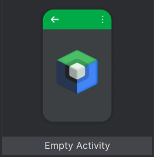

<br/>

### 📦 Configuración del nuevo proyecto

Ahora completaremos los campos principales del asistente de configuración 👇

#### 1️⃣ Nombre del proyecto 🏷️

Escribe el nombre de tu proyecto.  
Por ejemplo:

> `JetpackComposeCourseBasic`

#### 2️⃣ Nombre del paquete (Package Name) 📦

💡 **¿Qué es el Package Name?**

Cuando compilas tu app 📲 y la subes a la **Play Store**, ese nombre debe ser **único e irrepetible** 🌍.

Por convención, se usa el **dominio web al revés**:

> Si tu dominio es `example.com`, tu paquete sería: `com.example.jetpackcomposecoursebasic`

Esto evita conflictos con otras aplicaciones.

> Aunque podrías escribir cualquier cosa (por ejemplo “.abc”), siempre es mejor seguir el estándar profesional

#### 3️⃣ Save Location 💾

Selecciona la carpeta donde se guardará tu proyecto.

#### 4️⃣ Minimum SDK 📱

Aquí definimos **desde qué versión de Android podrá ejecutarse tu aplicación**.  
Este valor es importante porque determina la **compatibilidad mínima** de tu app con los dispositivos actuales 📲.

> 💡 **Recomendación:** selecciona **Android (API 24)**. Es la opción más equilibrada y recomendada hoy en día, ya que **la mayoría de los dispositivos activos** son compatibles con esta versión o superior.

Esto significa que tu app funcionará perfectamente **desde Android 7 en adelante** 🆙  
y cubrirás un **amplio rango de usuarios** sin preocuparte por versiones antiguas que casi nadie utiliza.

⚠️ Si eliges una API más baja, podrías tener que **adaptar tu código a funciones obsoletas** o limitadas. Por eso, mantenerte en API 24 o superior te garantiza **mejor rendimiento y compatibilidad moderna** 🚀

#### 5️⃣ Build Configuration Language 🧱

Este campo define el lenguaje que usará **Gradle** para compilar tu proyecto.

**Gradle** es la herramienta que:

- ⚡ Construye tu app
- ⚙️ Gestiona dependencias externas (como librerías o APIs 🌐)
- 🧩 Define módulos, versiones y configuraciones

Antes, Gradle usaba **Groovy DSL**, pero las versiones nuevas de Android Studio recomiendan usar **Kotlin DSL** 💪

> Esto significa que tu archivo `build.gradle.kts` estará escrito directamente en **Kotlin**, haciendo más fácil y legible la configuración del proyecto.

<br/>

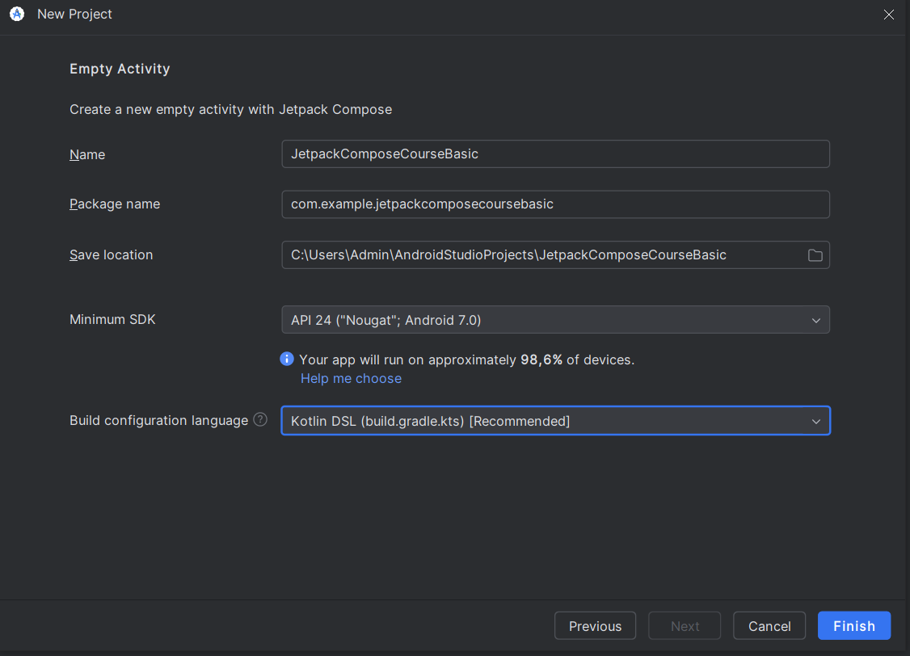

<br/>

Entonces seleccionamos **Kotlin DSL**, haz clic en **“Finalizar” 🏁**, y… ¡listo! Android Studio creará automáticamente tu proyecto Compose. Desde mi version de android studio (Android Studio Narwhal 3 Feature Drop | 2025.1.3) obtengo:

<br/>


<br/>

<br/><hr/><br/>

## [2. 🚀 Primer paso: entender la estructura base del proyecto](#-índice--capítulo-2-contenedores-en-jetpack-compose)

Cada vez que creamos un proyecto nuevo en Android Studio, se genera una clase principal llamada MainActivity 📄.

<br/>

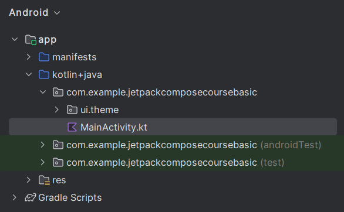

<br/>

Esta clase es el punto de partida de nuestra aplicación: es la primera pantalla por donde el sistema operativo Android ingresa cuando abrimos la app 🔑.

📁 Estructura básica del proyecto

En el panel izquierdo de Android Studio (explorador de archivos) verás varias carpetas.
No analizaremos todas, pero sí las más importantes para esta sesión 👇:

📦 Carpeta app

Dentro de esta carpeta está todo el código de la aplicación.
Ahí verás otras subcarpetas clave:

1️⃣ manifests/

Contiene el archivo AndroidManifest.xml 🧾

<br/>

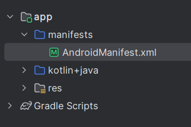

<br/>

Aquí se declaran los permisos de la app (📷 cámara, 📍 geolocalización, 🌐 internet, etc.). También se puede definir el icono de la aplicación y otras configuraciones generales.

👉 Por ahora, recuerda que aquí controlamos permisos y metadatos del proyecto.

2️⃣ kotlin + java/

<br/>

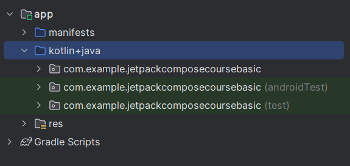

<br/>

Dentro verás tres carpetas:

La principal, donde está el código de la app y dos carpetas adicionales para pruebas o testing 🧪 (las veremos más adelante)

Cuando abres la carpeta principal (que tiene el nombre de tu paquete, por ejemplo com.midominio.miapp), verás los archivos del proyecto.Los más importantes por ahora son:

<br/>

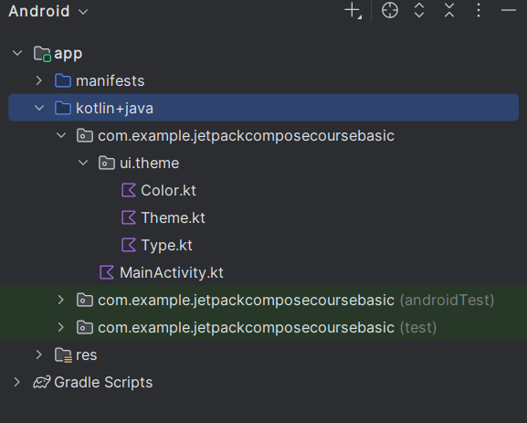

<br/>

🧭 MainActivity.kt — el archivo donde inicia la app

🎨 Carpeta ui/ — contiene los colores, temas y tipografías de la interfaz

🎨 Dentro de la carpeta ui/

Aquí configuramos todo el estilo visual de la aplicación: Colores del tema (modo claro 🌞 y modo oscuro 🌙); Tipografía que se usará; Configuraciones de Material Design 3, la guía moderna de diseño de Android

**⚙️ La clase MainActivity.kt**

Volviendo al archivo principal (**MainActivity.kt**), esta clase se ejecuta apenas abrimos la aplicación. Dentro de ella hay una función muy importante llamada:

```kotlin
override fun onCreate(savedInstanceState: Bundle?) {
    super.onCreate(savedInstanceState)
    setContent {
        // Aquí va TODO el contenido visual de Jetpack Compose
    }
}
```

<br/>

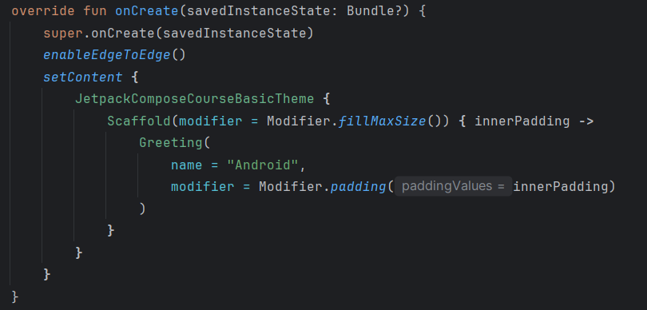

<br/>

📲 onCreate() se activa automáticamente al iniciar la app y muestra la primera pantalla

🧩 Todo lo que creemos con **Jetpack Compose** se debe escribir dentro de la función **setContent { ... }**

🔹 Aquí declararemos nuestras vistas, botones, textos, imágenes, etc.
🔹 Si Android Studio genera un código de ejemplo (como un “Hello Android”), puedes borrarlo 🧹 para empezar desde cero con tu propia interfaz.

<br/>

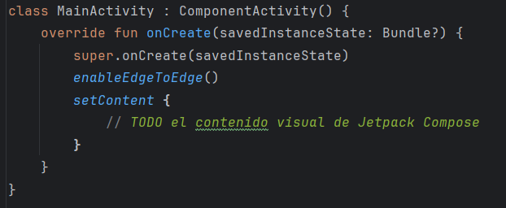

<br/>

Y para finalizar borra tambien todo lo que selecciono en la imagen siguiente debajo de la clase MainActivity (todo el @Composable y la @Preview), luego explicaremos como crearlo nosotros mismo, y que significa.

<br/>

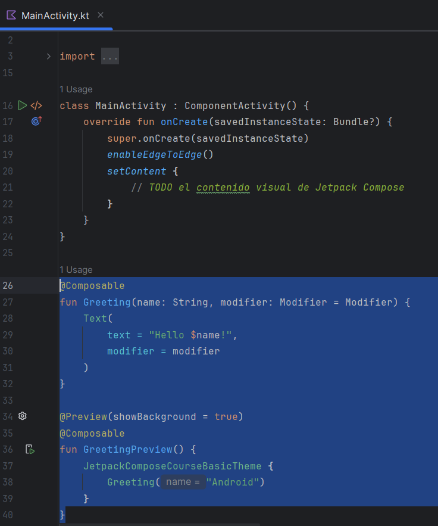

<br/>

Vamos a empezar desde cero. No quiero que nos confundamos. Tu archivo debe quedar así:
👉 Solamente un setContent { } vacío.

<br/>

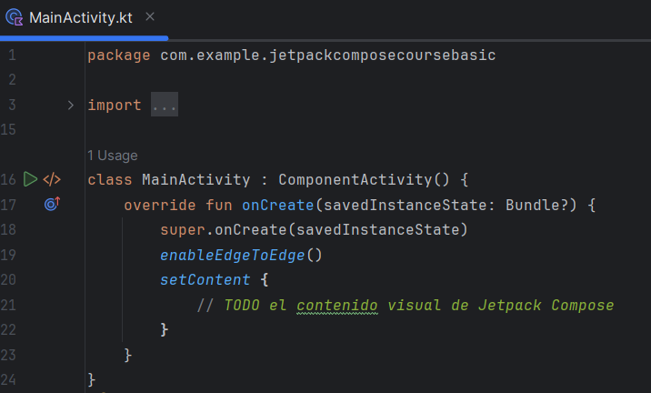

<br/><hr/><br/>

## [3. 🎨 Creando tu primer Composable y Preview](#-índice--capítulo-2-contenedores-en-jetpack-compose)

Ahora vamos a empezar a pintar algo en pantalla. En **Jetpack Compose**, todo lo que ves en la UI se construye con funciones Composable. Nosotros le decimos a Compose qué mostrar, y Compose se encarga de cómo dibujarlo.

- 1️⃣ **Declarando una función Composable 🤔**

Crear un Composable es muy sencillo. Solo necesitas usar la palabra clave **@Composable** antes de tu función.

```kotlin
@Composable
fun MyFirstComposable() {
    Text(text = "Hola! Soy Brea developer")
}
```

<br/>

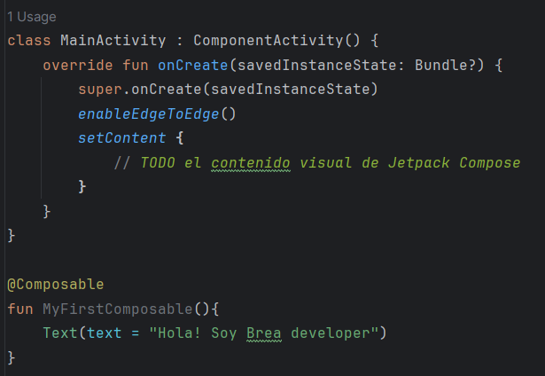

<br/>

💡 Explicación:
**@Composable** indica que esta función dibuja algo en la UI.
**Text** es un composable predefinido que muestra texto. Si ponemos el cursor sobre Text veremos como indica que Text es un composable.

<br/>

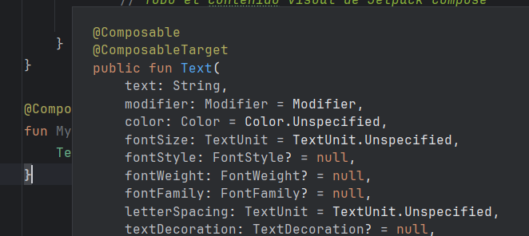

<br/>

**text = "Hola! Soy Brea"** define el contenido que se verá en pantalla.

> 💡 **Tip rápido**: En Android Studio, no necesitas escribir todo manualmente. Escribe comp y verás un shortcut para crear un Composable automáticamente. Presiona Enter ⏎ y se generará la estructura base. Solo asigna un nombre a tu función y agrega el contenido que quieras pintar.

<br/>

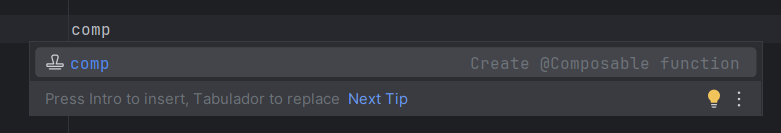

<br/>

- 2️⃣ **Usando Preview 👁️‍🗨️**

Como en XML podíamos ver un visor visual, en Compose usamos **@Preview** para previsualizar nuestro Composable en Android Studio.

```kotlin
@Preview(name = "My Preview")
@Composable
fun MyFirstComposablePreview(){
    MyFirstComposable()
}
```

**name = "My Preview"** es un atributo que nos da el nombre de la preview.

**💡 ¿Qué es un atributo?**

Un atributo es una propiedad o configuración que le damos a un elemento para que se comporte de cierta manera o tenga ciertas características. En XML, por ejemplo, un botón puede tener atributos como android:text="Hola" o android:background="#FF0000".
En Compose, los atributos cumplen la misma función: definen cómo se verá o cómo se comportará un Composable.

En resumen: los atributos son parámetros opcionales que modifican el comportamiento o la apariencia de un Composable.

Dentro de fun Preview le decimos que funcion composable quieres mostrar. En nuestro caso le decimos MyFirstComposable()

<br/>

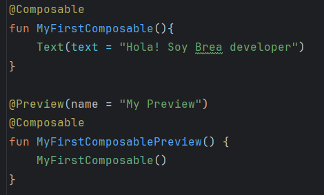

<br/>

- **3️⃣ Visualizando la Preview en Android Studio**

Dirígete a la parte superior derecha del editor 🧭

Encontrarás las opciones:

🧩 Code | Split | Design

<br/>

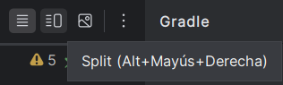

<br/>

Selecciona Split 🖥️ para ver mitad código, mitad preview. Luego le tienes que dar a refrescar y en unos segundos tenemos el preview listo.

Verás el resultado de tu Composable: "Hola! Soy Brea developer"

<br/>


<br/>

Podemos mejorar un poco la visualización de nuestra Preview, gracias a los atributos. Si añadimos los siguientes atributos:

<br/>

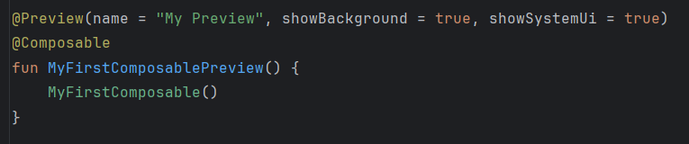

<br/>

- **showBackground** → si lo pones en true, te muestra un fondo blanco ⚪
- **showSystemUi** → si lo pones en true, te muestra todo el dispositivo completo 📱

<br/>

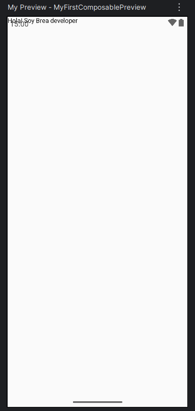

<br/>

**Un punto importante antes de continuar**

Hay algo que debemos tener muy en cuenta: si ejecutas la aplicación tal como está ahora mismo… ¿qué crees que va a pasar? 🤔 No se va a mostrar nada en pantalla. 🚫

👉 **¿Por qué?**

Porque lo que realmente se ejecuta cuando presionas Run ▶️ no es la preview, sino el contenido que tengas dentro del **MainActivity**.

La **preview** es solo eso: una previsualización dentro del editor …pero no es lo que la app renderiza al ejecutarse.

📌 Entonces, **¿qué debemos hacer?**

Si quieres que en el emulador se vea lo mismo que aparece en tu preview, debes llamar a tu función composable desde el MainActivity.

Por ejemplo, en tu MainActivity, dentro del **setContent**, coloca tu composable así:

```kotlin
    setContent {
        MyFirstComposable()
    }
```

<br/>

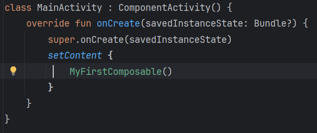

<br/>

🚀 **¿Qué pasa ahora cuando ejecutas la app?**

Cuando le das a Run ▶️, el emulador abrirá tu aplicación y Android dirá:

“Ok, debo ejecutar MyFirstComposable()”.

Y entonces pintará en pantalla lo que hayas definido en esa función. Por ejemplo, si tu composable muestra el texto "Hola! Soy Brea developer", eso es lo que aparecerá.

Por lo tanto, la función principal de las Previews son mostrar como se verá nuestra app sin tener que ejecutar el emulador.

<br/>

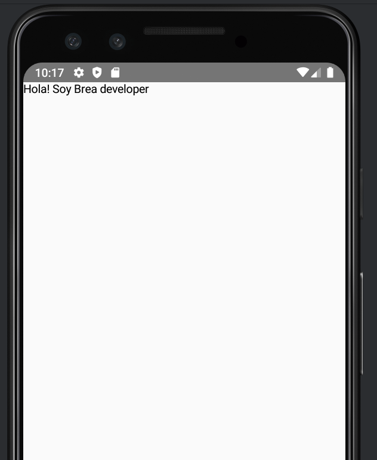

<br/><hr/><br/>

## [4. 🤨 Entendiendo el comportamiento de Compose al organizar componentes](#-índice--capítulo-2-contenedores-en-jetpack-compose)

Ahora vamos a enfocarnos en nuestro composable para comprender un concepto muy importante dentro de Jetpack Compose.

Imagina que colocas dos textos directamente, uno debajo del otro, así como están.

```kotlin
    @Composable
    fun MyFirstComposable(){
        Text(text = "Hola! Soy Brea developer")
        Text(text = "Hola! Soy Brea EEEEEEEEEEEEEEEEEEEE")
    }
```

<br/>

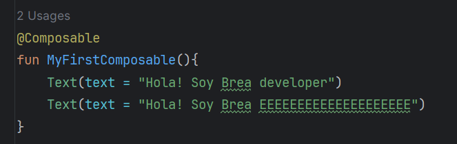

<br/>

Lógicamente podríamos pensar:

“Debería aparecer un texto al costado del otro”, o “Quizás uno abajo del otro”…

Pero eso no es lo que realmente pasa.

En Compose, cuando colocas dos elementos sin ningún contenedor que los organice,
Compose los apila, es decir, los pone uno encima del otro. Como si los pegara en la misma posición exacta 🧱⬆️⬆️. Si refrescamos nuestra preview, observamos lo siguiente:

<br/>

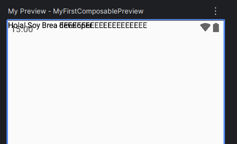

<br/>

🧩 **¿Por qué ocurre esto?**

Este es el comportamiento por defecto de Compose cuando no hay un contenedor
(Column, Row, Box, etc.) que le diga cómo debe organizar los elementos.

En otras palabras:

“Si no me especificas nada, yo los pongo uno encima del otro”.

<br>

🧱 **¿Por qué usar contenedores en Compose?**

Bueno, hasta aquí vimos que si ponemos dos textos sin ningún contenedor, Compose simplemente los monta uno encima del otro. Pero seamos sinceros… en una app real nadie quiere eso 😅

Normalmente vamos a querer algo mucho más ordenado, como:

👉 poner un elemento debajo del otro
👉 o ponerlos uno al lado del otro

Dependiendo del diseño que estemos haciendo 🎨

Y para eso necesitamos usar **contenedores**.

Los **contenedores** son los que le dicen a Compose cómo organizar los elementos en pantalla. Vamos a estudiar tres contenedores súper importantes:

- 1️⃣ Box 📦
- 2️⃣ Column 🧩
- 3️⃣ Row ↔️

<br/>

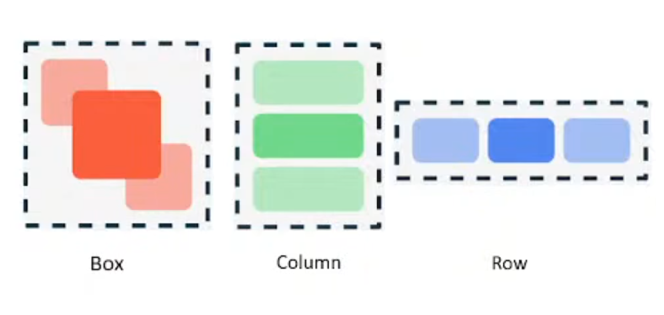

<br/>

👉 **Box:** El Box es como el **FrameLayout de XML**. Imagínate una caja donde puedes meter varios componentes y Compose los va apilando, es decir, uno encima del otro. Sirve mucho cuando necesitas superponer cosas. Por ejemplo: texto arriba de una imagen, íconos flotando, etc.

👉 **Column:** La Column es la más fácil de todas. Todo lo que pongas dentro va a quedar uno debajo del otro ⬇️

👉 **Row:** La Row funciona al revés que la Column: colocan los elementos uno al lado del otro ↔️ Perfecta para filas, menús horizontales, etc.

<br/><hr/><br/>

## [5. 📏 Usando Column y modifiers: organizando y dando estilo a tus composables](#-índice--capítulo-2-contenedores-en-jetpack-compose)

Bueno, ahora sí vamos a empezar a usar estos contenedores 💪
Por ejemplo, si lo que queremos es que los textos queden uno debajo del otro, entonces tenemos que usar una **Column**.

Mira, es súper simple 👇 Solo llamamos al composable Column (acuérdate: en Compose todo son composables):

<br/>

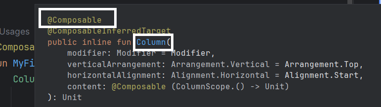

<br/>

Escribimos Column dentro de nuestro @Composable y dentro de column copiamos los dos Text:

```kotlin
    @Composable
    fun MyFirstComposable(){
        Column {
            Text(text = "Hola! Soy Brea developer")
            Text(text = "Hola! Soy Brea EEEEEEEEEEEEEEEEEEEE")
        }
    }
```

<br/>

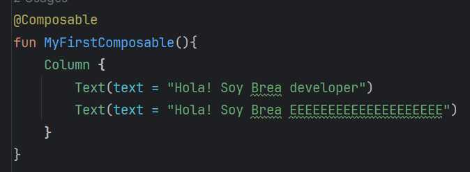

<br/>

Y listo. **¿Qué va a pasar con esto?** Pues exactamente lo que esperamos: Compose va a poner un texto debajo del otro, tal como los escribimos.

<br/>

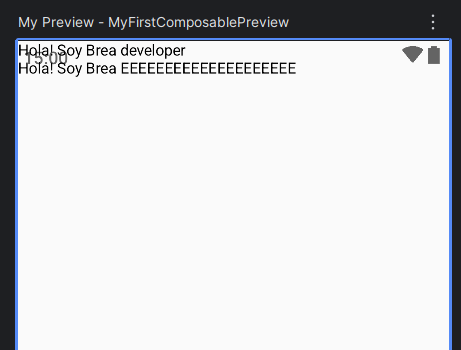

<br>

👉 **Concepto importante: ¿Cómo ver los atributos de un Composable?**

Cuando trabajamos con Compose, tenemos que aprender a manejar bien los atributos. Eso es lo que nos va a permitir darle:👉 color 👉 forma 👉 tamaño 👉 y estilo a cada componente.

Entonces, ¿qué vamos a hacer ahora? Voy a empezar por darle algunos atributos a mi Column. Pues lo que hacemos es ponerle paréntesis () y, dentro de esos paréntesis, vamos agregando los atributos que la Column puede recibir.

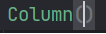

🤷‍♂️ **¿Y cómo sé qué atributos tiene un composable como Column?**

Hay varias formas de verlo, y todas son súper útiles. Mira:

1. Pararte encima del composable y **presionar Ctrl**

Si haces eso, Compose te muestra una ayuda. Ahí te indica que Column recibe: un modifier 🛠️, un verticalArrangement ↕️, un horizontalAlignment ↔️ ...


No te preocupes si no sabes qué es cada cosa todavía, eso lo vemos enseguida 👀 Pero ahí mismo tienes la documentación básica.

2. Presionar **Ctrl + Click** sobre Column

Esto te lleva directo a su documentación 📄 Ahí puedes leer qué es exactamente una Column, qué parámetros acepta y para qué sirve cada uno.

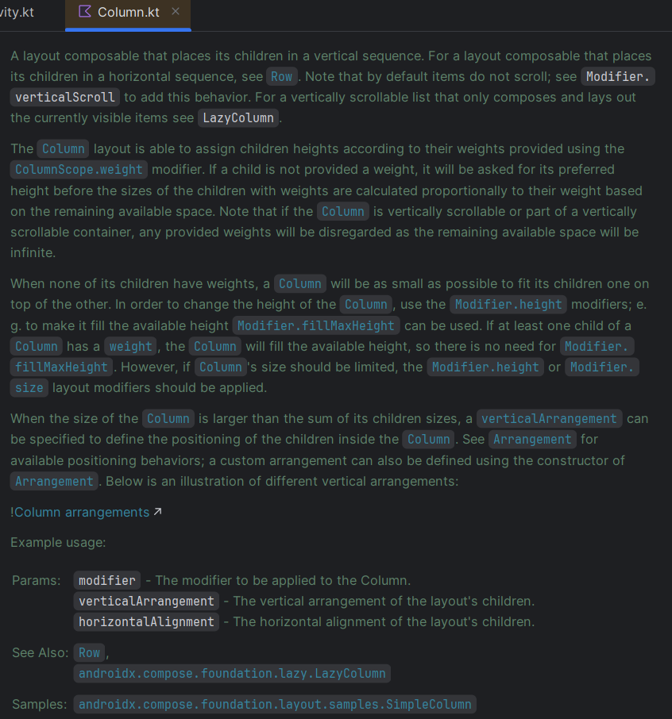

3. Presionar **Ctrl + P** dentro de los paréntesis ()

Esta es una de las más usadas. Compose te muestra una ventanita con todos los parámetros disponibles. Es como tener una mini guía técnica sin salir del código.

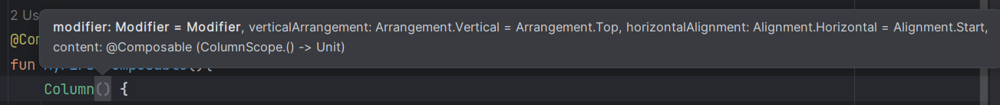

<br>

🛠️ Antes nombramos el modifier, pero **¿Qué es el modifier?**

Los **modificadores** sirven para modificar el composable, es decir, cambiarle cosas como:Ancho, Alto, Tamaño de texto, Color ... y mucho más, dependiendo del tipo de composable que estés usando.

**¿Cómo lo hacemos?** Muy simple: Ponemos modifier y le vamos agregando las propiedades que necesitamos.

- Ejemplo de uso: Podemos asignarle al modifier varias propiedades: height, padding, size, background, weight ... Si queremos hacer algo más “cool”, por ejemplo rotar el composable 🔄 para animaciones 🎬, o recortar una imagen circular 🔵, con Compose es mucho más fácil que en XML.

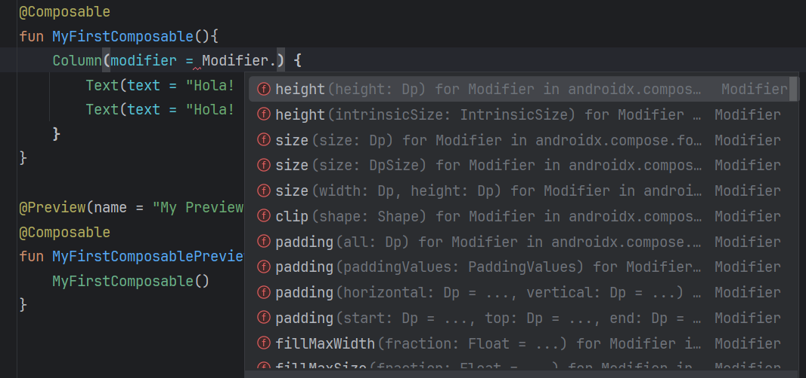

Antes en XML había que usar librerías extra y luego clip para recortar la imagen. En Compose todo esto lo hacemos directo y mucho más simple.

💡 **Haciendo que la columna ocupe toda la pantalla**

Lo primero que vamos a hacer es decirle a la columna que ocupe todo el ancho y todo el alto de la pantalla. Eso se hace con:

```kotlin
    Modifier.fillMaxSize()
```

Para los que vienen de XML, es básicamente como usar match_parent ✅.

🎨 **Agregando más modificadores**

Si queremos agregar más propiedades, simplemente las usamos el punto .:

```kotlin
Modifier.fillMaxSize().background(Color.Green)
```

Si tu tecleas **ctrl + alt + L** te lo ajusta en distintas filas, quedando mejor visualmente:

```kotlin
modifier = Modifier
            .fillMaxSize()
            .background(Color.Green)
```

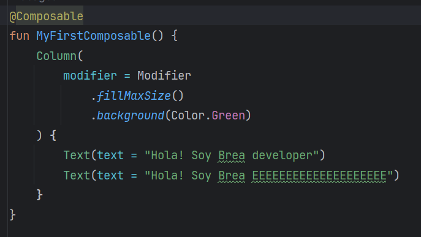

Resultado: nuestra columna ocupa toda la pantalla y tiene un background verde 🌿

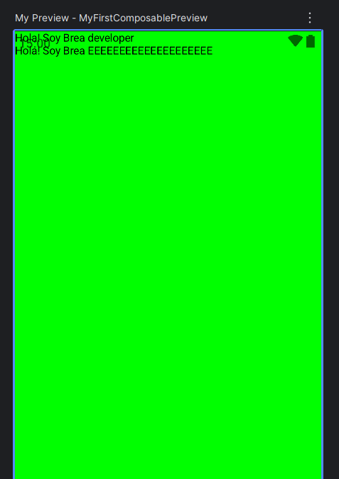

📝 **Concepto clave,** esto nos enseña algo muy importante de Compose: no le decimos paso a paso cómo hacer algo, solo describimos el resultado que queremos, y Compose lo hace. En otras palabras: “quiero que esta columna ocupe toda la pantalla y tenga fondo verde”, y listo, Compose lo entiende.

Recuerda, los modificadores existen varios, y los agregas usando puntos .. Pero además, si presionas **Ctrl + P** dentro del paréntesis de Column, también puedes ver otros atributos que no son modificadores, como: verticalArrangement ↕️, horizontalAlignment ↔️

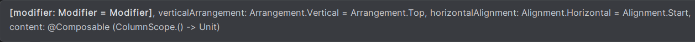

Por ejemplo, si quiero centrar horizontalmente los elementos de una columna, puedes hacerlo asi:

```kotlin
    horizontalAlignment = Alignment.CenterHorizontally
```

Solo pones coma y continúas agregando los atributos que quieras.

```kotlin
    @Composable
    fun MyFirstComposable() {
        Column(
            modifier = Modifier
                .fillMaxSize()
                .background(Color.Green),
            horizontalAlignment = Alignment.CenterHorizontally
        ) {
            Text(text = "Hola! Soy Brea developer")
            Text(text = "Hola! Soy Brea EEEEEEEEEEEEEEEEEEEE")
        }
    }
```

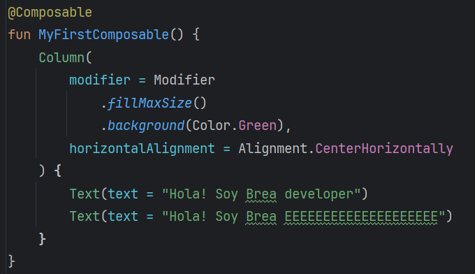

**HorizontalAlignment = Alignment.CenterHorizontally** → centra los hijos de la columna horizontalmente (recuerda que los hijos son los elementos que están dentro de Column, en nuestro caso los dos Text)

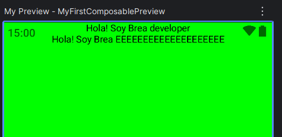

Ahora agregamos otro atributo para poder centrar verticalmente los hijos o elementos que contienen Column. Agregamos con una coma el siguiente código:

```kotlin
    Column(
            modifier = Modifier
                .fillMaxSize()
                .background(Color.Green),
            horizontalAlignment = Alignment.CenterHorizontally,
            verticalArrangement = Arrangement.Center
        )
        { ... }
```

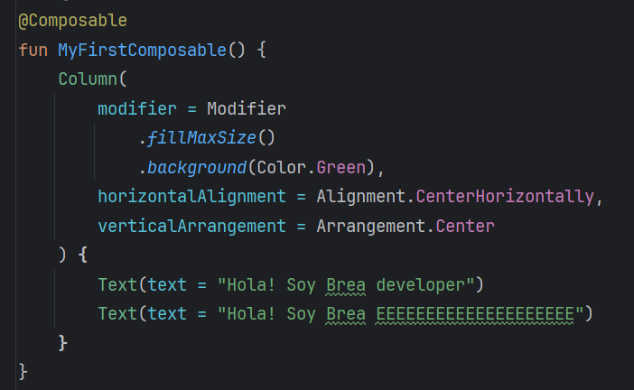

**VerticalArrangement = Arrangement.Center** ↕️ → centra verticalmente los hijos o elementos que contiene Column.

Resultado: los elementos quedan justo en el centro de la pantalla

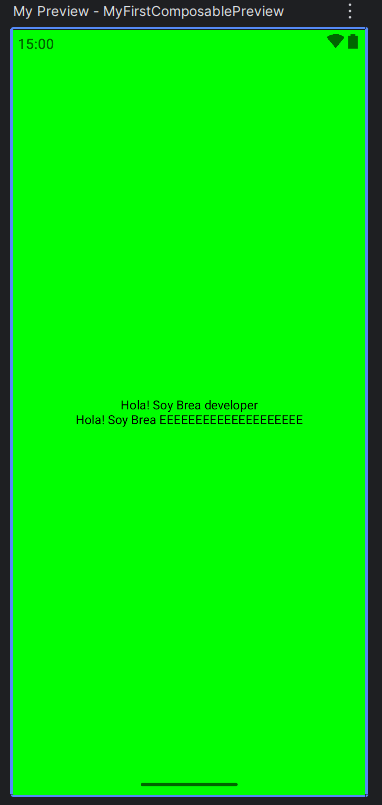

**Nota**: normalmente Compose renderiza rápido ⚡, pero si tu computadora va lenta 🐢, puede demorarse o tardar un poco. En máquinas potentes esto se hace prácticamente al instante.

<br>

📌 **Otras opciones de VerticalArrangement:**

**verticalArrangement = Arrangement.Center** → centra los hijos de Column

**verticalArrangement = Arrangement.SpaceBetween** → separa los hijos de Column dejando un espacio proporcional entre ellos

**verticalArrangement = Arrangement.SpaceAround** → deja espacio alrededor de los hijos

- Por ejemplo, si usamos SpaceBetween:

```kotlin
    verticalArrangement = Arrangement.SpaceBetween
```

Cada hijo se separa proporcionalmente, dejando un espacio equitativo 📏.

🔄 Combinando todo

```kotlin
    Column(
    modifier = Modifier
    .fillMaxSize()
    .background(Color.Green),
    horizontalAlignment = Alignment.CenterHorizontally,
    verticalArrangement = Arrangement.SpaceBetween
    ) {
    Text("Hola! Soy Brea developer")
    Text("Hola! Soy Brea EEEEEEEEEEEEEEEEEEEE")
    }
```

El resultado de nuestra preview seria el siguiente:


Si en vez de tener dos Text, Tenemos tres Text:

```kotlin
    Text(text = "Hola! Soy Brea developer")
    Text(text = "Hola! Soy Brea EEEEEEEEEEEEEEEEEEEE")
    Text("Hola Brea Developer BBBBBBBBB")
```

Con **SpaceBetween**, Compose lo separa automáticamente y deja espacios proporcionales entre todos los textos. Así, el primero queda arriba, el último abajo y el del medio en el centro.

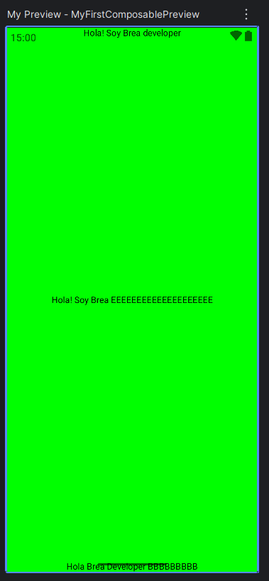

<br>

🎯 **SpaceBy**

También existe **SpaceBy**, que te deja un espacio fijo entre los elementos. Por ejemplo, si quieres 12.dp entre los hijos:

```kotlin
    verticalArrangement = Arrangement.spacedBy(12.dp)
```

- **dp** → **densidad por píxel**, se usa para todo lo visual

- **sp** → se usa para texto, para escalar según densidad de pantalla

Entonces si ponemos el siguiente codigo en nuestro @Composable:

```kotlin
    @Composable
    fun MyFirstComposable() {
        Column(
            modifier = Modifier
                .fillMaxSize()
                .background(Color.Green),
            horizontalAlignment = Alignment.CenterHorizontally,
            verticalArrangement = Arrangement.spacedBy(12.dp)
        ) {
            Text(text = "Hola! Soy Brea developer")
            Text(text = "Hola! Soy Brea EEEEEEEEEEEEEEEEEEEE")
            Text("Hola Brea Developer BBBBBBBBB")
        }
    }
```

Seguro que dp te marcará como error, porque tendrás que importarlo. Solo tienes que darle click a la bombilla roja que te marca Android Studio y darle importar.

El resultado es el siguiente:

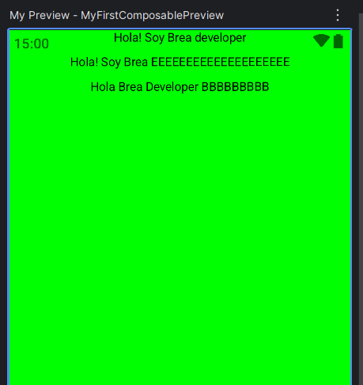

- ➡️ **Regla general**:
  - Texto → .sp
  - Todo lo demás → .dp

**Caso práctico**: Imagina que quieres poner botones en una pantalla de login, separados de forma proporcional puedes usar SpaceBy(10.dp) y listo 😎 Ya están perfectamente separados y alineados. Eso es exactamente lo que hace **SpaceBy**, super útil para layouts ordenados en Compose.

<br/><hr/><br/>

## [6. ↔️ Introducciendo las Rows](#-índice--capítulo-2-contenedores-en-jetpack-compose)

Hasta ahora hemos estado trabajando con Column, pero las Row funcionan exactamente igual… solo que en horizontal ➡️⬅️

La idea es simple:

- **Column** → coloca elementos uno debajo del otro ⬇️⬇️
- **Row** → coloca elementos uno al lado del otro ➡️⬅️

Vamos a crear un nuevo Composable para las filas:

```kotlin
    @Composable
    fun DataRows() {
        Row { }
    }
```

<br/>

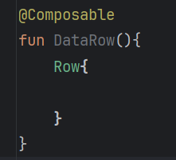

<br/>

Yo le puse DataRow porque sí, puedes ponerle el nombre que quieras. Lo importante es que Row es otro Composable, igual que Column.

<br/>

### **🔘 Agregando elementos dentro de una Row**

<br/>

Dentro de una Row puedes poner cualquier cosa: textos, imágenes, botones, etc. Como ejemplo, vamos a poner tres botones:

```kotlin
    Row {
        Button(onClick = { }) { Text("Botón 1") }
        Button(onClick = { }) { Text("Botón 2") }
        Button(onClick = { }) { Text("Botón 3") }
    }
```

<br/>

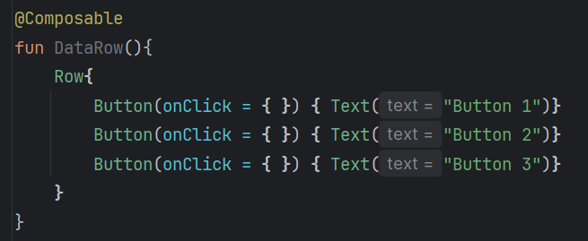

<br/>

Esto ya debería mostrarnos tres botones uno al lado del otro 👌 Peeero… falta algo importante.

<br/>

**👀 ¿Por qué no se muestra mi Row?**

Aunque hayas creado DataRows(), si nadie llama a esa función, no aparece en pantalla. Tu Preview probablemente está llamando a MyFirstComposable() (la columna), por eso no ves la Row.

<br/>

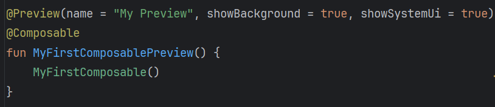

<br/>

Solución: crear otra Preview.

<br/>

### **📱 Crear una Preview para ver la Row**

Puedes tener varias previews sin problema. De hecho es súper útil.

```kotlin
    @Preview(showBackground = true)
    @Composable
    fun MyRowPreview() {
        MyRows()
    }
```

<br/>

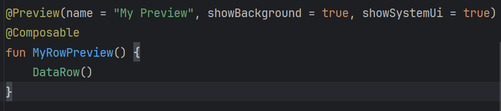

<br/>

Ahora Compose te mostrará otra vista previa abajo ⬇️ Una preview llama a tu Column, la otra a tu Row.

<br/>

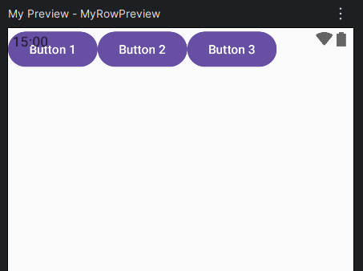

<br/><hr/><br/>

## [7. 🎛️ Modifiers y alineaciones en Row](#-índice--capítulo-2-contenedores-en-jetpack-compose)

Al igual que las Column, las Rows también tienen modifier.
Ejemplo básico:

```kotlin
Row(
    modifier = Modifier.fillMaxWidth()
)
```

<br/>


<br/>

Con esto la Row ocupa todo el ancho disponible 📏.

Si quieres que ocupe toda la pantalla:

```kotlin
Modifier.fillMaxSize()
```

<br/>

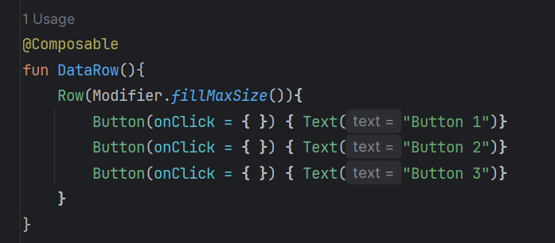

<br/>

Ya explicamos esto, así que no profundizo más porque ya vimos cómo funcionan los modifiers 😉

<br/>

### 🧭 Alineaciones en Row (importante)

Column y Row tienen propiedades muy parecidas, pero los nombres se invierten según el eje.

- En Column tenemos: verticalArrangement y horizontalAlignment

- En Row tenemos: horizontalArrangement y verticalAlignment

**¿Por qué cambia los atributos según column?**
Porque Row trabaja de izquierda a derecha → Su eje principal es horizontal. Esto es muy importante para evitar confundirse cuando estés diseñando interfaces.

### 🎯 Aplicando alineación a nuestra Row

Vamos a hacer que los tres botones queden centrados en nuestra pantalla, entonces ponemos el siguiente código y recuerda pulsar [Ctrl+Alt+L] para que se alinee el código:

```kotlin
    Row(
        modifier = Modifier.fillMaxSize(),
        verticalAlignment = Alignment.CenterVertically,
        horizontalArrangement = Arrangement.Center
    ) {
        Button(onClick = { }) { Text("Botón 1") }
        Button(onClick = { }) { Text("Botón 2") }
        Button(onClick = { }) { Text("Botón 3") }
    }
```

<br/>

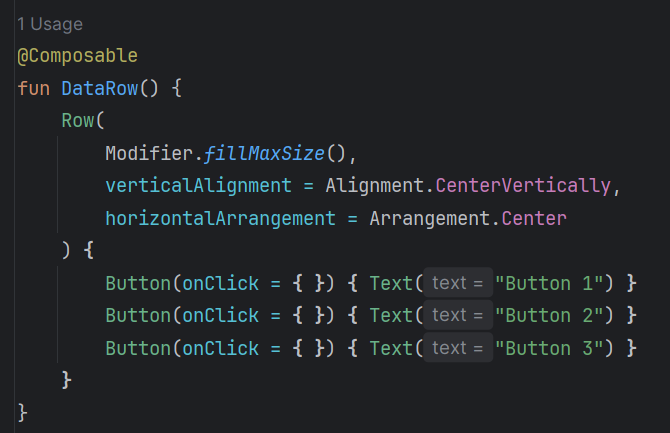

<br/>

Con esto: Los botones quedan alineados verticalmente al centro. Y también quedan centrados horizontalmente. Ocupan todo el ancho.

<br/>

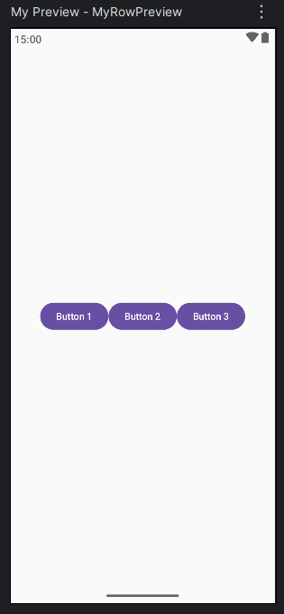

<br/>

**🎯 Centrar elementos dentro de una Row**

Cuando usas horizontalArrangement = Arrangement.Center, tus elementos quedan centrados en la fila. Y sí, esto funciona súper bien para colocar los botones exactamente en el medio 😊

Pero aquí viene un truco que muchos no saben al comienzo:

> **Tip de estudiante:** Si estás dentro de un Row (o cualquier Composable) y haces Ctrl + P, Compose te muestra todos los parámetros disponibles.

<br/>

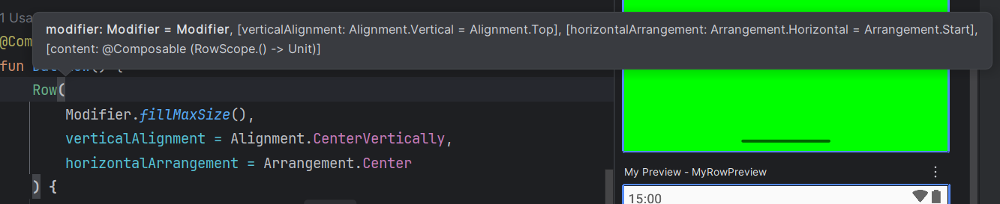

<br/>

**Ejemplo**: Ves horizontalArrangement = Arrangement.Start y dices: "Ah ok, empieza con Arrangement, voy a buscar más opciones". Y aparecen Arrangement.Center, Arrangement.End, etc. 🙌

Muy útil cuando recién estás aprendiendo.

<br/><hr/><br/>

(desarrollando)

<br/><hr/><br/>

| [⬅️ Ir al Capítulo 1](../docs/01-Introduccion.md) | [⬆️ Ir al inicio del capítulo](#-capítulo-2--contenedores-en-jetpack-compose) | [↩️ Volver al inicio del proyecto](../README.md) |
| :-----------------------------------------------: | :---------------------------------------------------------------------------: | :----------------------------------------------: |
