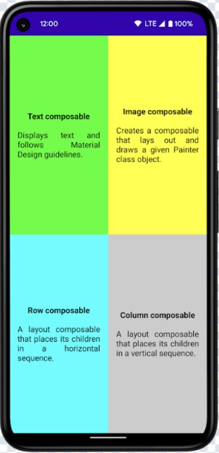
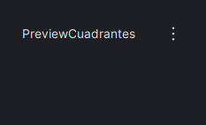
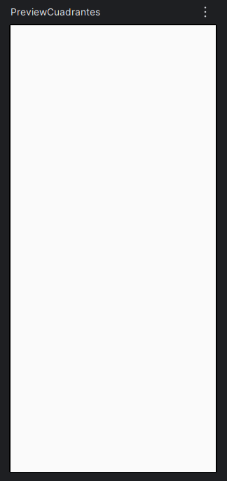
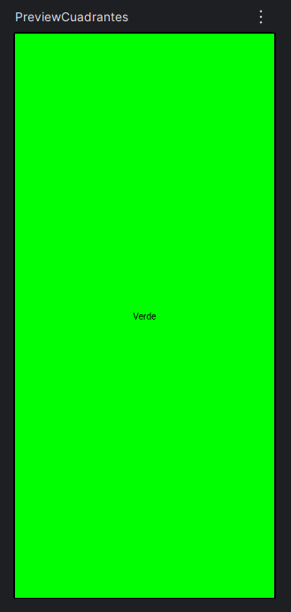
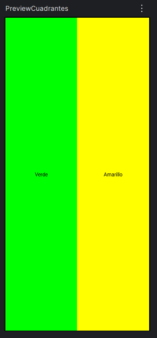
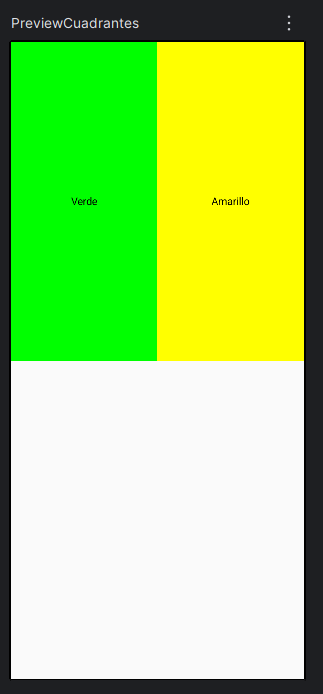
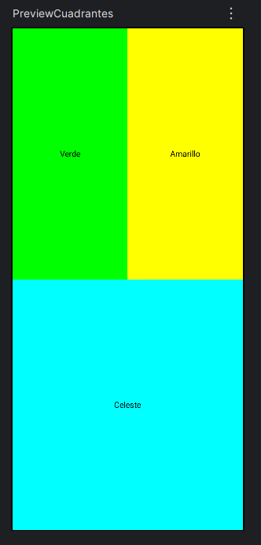
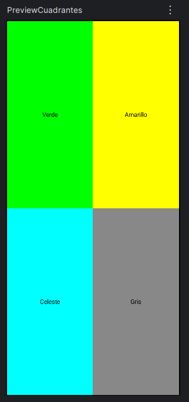
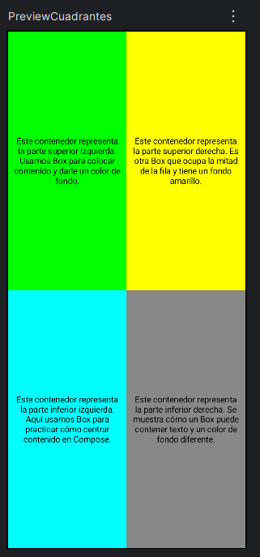

# Ejercicio 1: Practicando con contenedores

| [↩️ Volver al inicio del Proyecto](../../README.md) | [↩️ Volver al Capítulo 2](../../docs/02-contenedores.md) |
| :-------------------------------------------------: | :------------------------------------------------------: |

<br/><hr/><br/>

**Ejercicio 1:** Crea un preview que muestre algo similar a la siguiente imagen

<br/>



<br/>

**Solución:**

Como es el primer ejercicio vamos ir paso a paso, para que vayamos conociendo poco a poco como funciona Jetpack Compose. Por lo tanto, creamos un nuevo proyecto en Android Studio con la plantilla **Empty Compose Activity** le pones un nombre, en mi caso pondre Box001.

- Primero lo que hago es **limpiar el código generado por Android Studio**. Cuando creas un nuevo proyecto con Jetpack Compose, Android Studio genera un MainActivity que suele verse de esta forma:

```kotlin
    class MainActivity : ComponentActivity() {
        override fun onCreate(savedInstanceState: Bundle?) {
            super.onCreate(savedInstanceState)
            enableEdgeToEdge()
            setContent {
                Box001Theme {
                    Scaffold(modifier = Modifier.fillMaxSize()) { innerPadding ->
                        Greeting(
                            name = "Android",
                            modifier = Modifier.padding(innerPadding)
                        )
                    }
                }
            }
        }
    }

    @Composable
    fun Greeting(name: String, modifier: Modifier = Modifier) {
        Text(
            text = "Hello $name!",
            modifier = modifier
        )
    }

    @Preview(showBackground = true)
    @Composable
    fun GreetingPreview() {
        Box001Theme {
            Greeting("Android")
        }
    }
```

<br/>

Borramos toda la **@Preview y @Composable** que vienen de ejemplo, porque lo vamos a crear desde cero.

Si observamos la siguiente función **override fun onCreate(savedInstanceState: Bundle?)** del **MainActivity** que es la función primera que se activa cuando abrimos nuestra aplicación, esta sobrecargado para nuestro ejercicio. Por decir, tenemos cosas como estas:

**Scaffold** → añade barras y padding que no necesitamos.
**Greeting()** → función de ejemplo que no vamos a usar.
**innerPadding** → padding automático del Scaffold.
**enableEdgeToEdge()** → opcional, no necesario para ver la Preview.

Si dejamos esto tal cual, la Preview y el emulador no reflejarán exactamente lo que queremos construir.

<br/>

- Dejamos nuestra **MainActivity** limpio. Queremos que la Activity solo haga dos cosas: Aplicar el tema del proyecto (Box001Theme). Llamar a nuestro composable principal, que contendrá los cuadrantes.

Así queda:

```kotlin
    class MainActivity : ComponentActivity() {
        override fun onCreate(savedInstanceState: Bundle?) {
            super.onCreate(savedInstanceState)
            setContent {
                Box001Theme {
                    CuadrantesPantalla()
                }
            }
        }
    }
```

<br/>

Ahora la Activity no tiene Scaffold ni Greeting, solo nuestro composable **CuadrantesPantalla()**.

<br/>

- Crear el composable **CuadrantesPantalla()** principal. Fuera de la Activity (la activity hace referencia a la MainActivity), creamos el contenedor donde construiremos los cuadrantes:

```kotlin
    @Composable
    fun CuadrantesPantalla() {
        // Aquí iremos construyendo los cuadrantes paso a paso
    }
```

<br/>

Este composable con la función **CuadrantesPantalla()** será la base de nuestra UI. Tanto la **Preview** como la **Activity** llamarán a este composable, así que siempre verás el mismo resultado.

<br/>

- Finalmente creamos la **Preview** que la llamaremos **PreviewCuadrantes**, escribimos el siguiente código:

```kotlin
    @Preview(showBackground = true)
    @Composable
    fun PreviewCuadrantes() {
        CuadrantesPantalla()
    }
```

<br/>

Aquí decir que si ponemos **showBackground = true** permite ver mejor los colores y bordes de las cajas.

De esta forma ya tenemos el código escrito para que cada vez que modifiques CuadrantesPantalla(), la Preview se actualizará automáticamente.

```kotlin

    //Aquí tienes el código limpio para comenzar a desarrollar nuestro ejercicio

    class MainActivity : ComponentActivity() {
        override fun onCreate(savedInstanceState: Bundle?) {
            super.onCreate(savedInstanceState)
            setContent {
                Box001Theme {
                    CuadrantesPantalla()
                }
            }
        }
    }

    @Composable
    fun CuadrantesPantalla() {
        // Aquí iremos construyendo los cuadrantes paso a paso
    }

    @Preview(showBackground = true)
    @Composable
    fun PreviewCuadrantes() {
        CuadrantesPantalla()
    }
```

<br/>

Con esto ya tenemos nuestro entorno preparado para comenzar a desarrollar nuestro ejercicio. Nuestra **@Preview** se verá vacia de esta forma:

<br/>



<br/>

No te preocupes ahora iremos construyento nuestra aplicación. Esto es solo el inicio, solo hemos construido los cimientos de nuestra app.

<br/>

- Comenzamos construyendo la **columna principal**. Primero necesitamos un contenedor que ocupe toda la pantalla, dentro del cual luego pondremos las filas y las cajas. Para eso usamos un **Column**:

```kotlin
    @Composable
    fun CuadrantesPantalla() {
        Column(modifier = Modifier.fillMaxSize()) {
            // Aquí iremos añadiendo las filas
        }
    }
```

<br/>

Al escribir este código seguro que se pone **Column en rojo** junto a una **bombilla roja**, esto te indica que debes importar el paquete que contine Column.

**Column** organiza sus elementos verticalmente, uno debajo de otro.

**modifier = Modifier.fillMaxSize()** hace que la columna ocupe todo el ancho y alto de la pantalla.

Por ahora la **Preview** no mostrará nada, pero ya tenemos la base vertical para nuestros cuadrantes.

<br/>



<br/>

Guarda el archivo y mira la Preview: aunque esté vacía, ya ocupa toda la pantalla.

<br/>

- Añadimos la **primera fila** (la mitad superior): Queremos dividir la pantalla verticalmente en dos partes iguales: fila superior y fila inferior. Para eso añadimos una **Row** dentro de la **Column**:

<br/>

```kotlin
    @Composable
    fun CuadrantesPantalla() {
        Column(modifier = Modifier.fillMaxSize()) {
            Row(modifier = Modifier.weight(1f)) {
                // Aquí irán los dos cuadrantes de arriba
            }
            // La fila de abajo la añadiremos después
        }
    }
```

<br/>

Explico lo nuevo que hemos agregado. **Row** organiza sus elementos horizontalmente, uno al lado del otro.

**modifier = Modifier.weight(1f)** indica que esta fila ocupará una **fracción del espacio** disponible en la columna.

Cuando añadamos otra fila con **weight(1f)** debajo, ambas filas se repartirán la pantalla **50/50** verticalmente.

Si miras la Preview: continua visualmente sin cambios, pero ya tenemos la estructura vertical preparada, aunque todavía no hay colores ni texto.

<br/>

- Añadimos el **primer cuadrante: superior izquierdo (verde)**: Dentro de la fila que acabamos de crear, añadimos un Box que será nuestro primer cuadrante:

```kotlin
    @Composable
    fun CuadrantesPantalla() {
        Column(modifier = Modifier.fillMaxSize()) {
            Row(modifier = Modifier.weight(1f)) {
                Box(
                    modifier = Modifier
                        .weight(1f)
                        .fillMaxSize()
                        .background(Color.Green),
                    contentAlignment = Alignment.Center
                ) {
                    Text("Verde")
                }
                // Aquí irá el cuadrante superior derecho
            }
        }
    }
```

<br/>

Explicamos lo que hemos agregado: **Box** es un contenedor flexible que podemos usar para dibujar colores y centrar contenido.

**weight(1f)** reparte el espacio horizontal de la fila (en este caso ocupará la mitad).

**fillMaxSize()** hace que el Box use todo el espacio de su celda.

**contentAlignment = Alignment.Center** centra el texto dentro del cuadrante.

En este momento, la **Preview** solo muestra un cuadrante verde completo porque dentro de la columna hemos creado una sola fila (**Row**) y dentro de esa fila solo hay un **Box**. Como ese **Box** ocupa toda la fila (con **fillMaxSize()** y **weight(1f)**), la fila aparece completamente verde y no se ve ningún otro cuadrante. La fila inferior todavía no existe, y tampoco hemos añadido un segundo **Box** en la fila superior, por eso por ahora la pantalla parece un único cuadrante verde.

<br/>



<br/>

- Ahora añadimos el **segundo cuadrante** de la **fila superior** para que la fila se divida en dos partes iguales. Así podrás ver dos cuadrados juntos en la Preview.

```kotlin
    @Composable
    fun CuadrantesPantalla() {
        Column(modifier = Modifier.fillMaxSize()) {
            Row(modifier = Modifier.weight(1f)) {
                Box(
                    modifier = Modifier
                        .weight(1f)
                        .fillMaxSize()
                        .background(Color.Green),
                    contentAlignment = Alignment.Center
                ) {
                    Text("Verde")
                }

                Box(
                    modifier = Modifier
                        .weight(1f)
                        .fillMaxSize()
                        .background(Color.Yellow),
                    contentAlignment = Alignment.Center
                ) {
                    Text("Amarillo")
                }
            }
            // La fila inferior la añadiremos después
        }
    }
```

<br/>

Explicamos que hemos agregado: Ahora la **fila superior** tiene **dos Box**, cada uno con **weight(1f)**, así que se reparten la fila **50/50 horizontalmente**.

**Box** de la izquierda: verde con texto **“Verde”**.

**Box** de la derecha: amarillo con texto **“Amarillo”**.

Ahora, en la **Preview**, la fila superior está dividida en dos cuadrados horizontales: el verde a la izquierda y el amarillo a la derecha. Cada **Box** ocupa la mitad del ancho de la pantalla gracias a **weight(1f)** dentro de la **Row**, y ambos llenan toda la altura de la fila (que por ahora ocupa toda la pantalla porque todavía no hemos añadido la **fila inferior**). Por eso, visualmente, la pantalla aparece completamente ocupada, con verde en la mitad izquierda y amarillo en la mitad derecha, de arriba hacia abajo, y los textos centrados en cada cuadrante. La mitad “inferior” que queremos crear después aún no existe como fila separada, por eso todavía no hay cuadrados en esa parte.

<br/>



<br/>

- Ahora agregamos solo la segunda fila, sin los cuadros dentro aún, para que veas cómo afecta la Preview.

```kotlin
    @Composable
    fun CuadrantesPantalla() {
        Column(modifier = Modifier.fillMaxSize()) {
            // Fila superior
            Row(modifier = Modifier.weight(1f)) {
                Box(
                    modifier = Modifier
                        .weight(1f)
                        .fillMaxSize()
                        .background(Color.Green),
                    contentAlignment = Alignment.Center
                ) {
                    Text("Verde")
                }

                Box(
                    modifier = Modifier
                        .weight(1f)
                        .fillMaxSize()
                        .background(Color.Yellow),
                    contentAlignment = Alignment.Center
                ) {
                    Text("Amarillo")
                }
            }

            // Fila inferior (vacía por ahora)
            Row(modifier = Modifier.weight(1f)) {
                // Aquí añadiremos los dos cuadrantes inferiores después
            }
        }
    }
```

<br/>

Al agregar esta **segunda fila** vacía con **weight(1f)**, ahora la **fila superior** con verde y amarillo ocupa solo la mitad superior de la pantalla, y la **segunda fila** ocupa la mitad inferior, aunque todavía esté **vacía** y no tenga color.

<br/>



<br/>

La **Preview** ya muestra cómo la pantalla se divide verticalmente en dos partes iguales, dejando espacio para los cuadrantes inferiores que añadiremos a continuación.

- Ahora vamos a añadir solo el tercer cuadrante (la mitad inferior izquierda, color celeste) para ir viendo cómo afecta la Preview paso a paso.

```kotlin
    @Composable
    fun CuadrantesPantalla() {
        Column(modifier = Modifier.fillMaxSize()) {
            // Fila superior
            Row(modifier = Modifier.weight(1f)) {
                Box(
                    modifier = Modifier
                        .weight(1f)
                        .fillMaxSize()
                        .background(Color.Green),
                    contentAlignment = Alignment.Center
                ) {
                    Text("Verde")
                }

                Box(
                    modifier = Modifier
                        .weight(1f)
                        .fillMaxSize()
                        .background(Color.Yellow),
                    contentAlignment = Alignment.Center
                ) {
                    Text("Amarillo")
                }
            }

            // Fila inferior
            Row(modifier = Modifier.weight(1f)) {
                Box(
                    modifier = Modifier
                        .weight(1f)
                        .fillMaxSize()
                        .background(Color.Cyan),
                    contentAlignment = Alignment.Center
                ) {
                    Text("Celeste")
                }

                // Aquí irá el cuarto cuadrante
            }
        }
    }
```

<br/>

Al añadir solo este tercer cuadrante dentro de la **segunda fila**, como es el único **Box** dentro de esa fila, ocupa toda la mitad inferior de la pantalla, no solo la izquierda. La **fila superior** sigue dividida en verde y amarillo, pero la **fila inferior** ahora se pinta completamente de celeste, con el texto centrado. La mitad derecha inferior todavía no existe como un cuadrante separado, así que visualmente la fila inferior aparece entera en celeste, aunque luego añadiremos el cuarto cuadrante para dividirla en dos.

<br/>



<br/>

- Ahora añadimos el cuarto cuadrante (la mitad inferior derecha, color gris) para completar los 4 cuadrados de la pantalla.

```kotlin
    @Composable
    fun CuadrantesPantalla() {
        Column(modifier = Modifier.fillMaxSize()) {
            // Fila superior
            Row(modifier = Modifier.weight(1f)) {
                Box(
                    modifier = Modifier
                        .weight(1f)
                        .fillMaxSize()
                        .background(Color.Green),
                    contentAlignment = Alignment.Center
                ) {
                    Text("Verde")
                }

                Box(
                    modifier = Modifier
                        .weight(1f)
                        .fillMaxSize()
                        .background(Color.Yellow),
                    contentAlignment = Alignment.Center
                ) {
                    Text("Amarillo")
                }
            }

            // Fila inferior
            Row(modifier = Modifier.weight(1f)) {
                Box(
                    modifier = Modifier
                        .weight(1f)
                        .fillMaxSize()
                        .background(Color.Cyan),
                    contentAlignment = Alignment.Center
                ) {
                    Text("Celeste")
                }

                Box(
                    modifier = Modifier
                        .weight(1f)
                        .fillMaxSize()
                        .background(Color.Gray),
                    contentAlignment = Alignment.Center
                ) {
                    Text("Gris")
                }
            }
        }
    }
```

<br>

Con este cuarto cuadrante añadido, la **Preview** ahora muestra la pantalla completamente dividida en 4 cuadrantes iguales: la **fila superior** tiene verde a la izquierda y amarillo a la derecha, y la **fila inferior** tiene celeste a la izquierda y gris a la derecha. Cada fila ocupa la mitad de la pantalla verticalmente, y cada cuadrante dentro de la fila ocupa la mitad horizontal, logrando así una **cuadrícula 2x2** que cubre toda la pantalla, con los **textos centrados** en cada color.

<br/>



<br/>

Vamos a reemplazar los textos simples por un párrafo en cada cuadrante, donde cada párrafo sea como una definición de lo que representa el contenedor.

```kotlin
    @Composable
    fun CuadrantesPantalla() {
        Column(modifier = Modifier.fillMaxSize()) {
            // Fila superior
            Row(modifier = Modifier.weight(1f)) {
                Box(
                    modifier = Modifier
                        .weight(1f)
                        .fillMaxSize()
                        .background(Color.Green),
                    contentAlignment = Alignment.Center
                ) {
                    Text(
                        "Este contenedor representa la parte superior izquierda. Usamos Box para colocar contenido y darle un color de fondo.",
                        color = Color.Black,
                        textAlign = TextAlign.Center,
                        modifier = Modifier.padding(8.dp)
                    )
                }

                Box(
                    modifier = Modifier
                        .weight(1f)
                        .fillMaxSize()
                        .background(Color.Yellow),
                    contentAlignment = Alignment.Center
                ) {
                    Text(
                        "Este contenedor representa la parte superior derecha. Es otra Box que ocupa la mitad de la fila y tiene un fondo amarillo.",
                        color = Color.Black,
                        textAlign = TextAlign.Center,
                        modifier = Modifier.padding(8.dp)
                    )
                }
            }

            // Fila inferior
            Row(modifier = Modifier.weight(1f)) {
                Box(
                    modifier = Modifier
                        .weight(1f)
                        .fillMaxSize()
                        .background(Color.Cyan),
                    contentAlignment = Alignment.Center
                ) {
                    Text(
                        "Este contenedor representa la parte inferior izquierda. Aquí usamos Box para practicar cómo centrar contenido en Compose.",
                        color = Color.Black,
                        textAlign = TextAlign.Center,
                        modifier = Modifier.padding(8.dp)
                    )
                }

                Box(
                    modifier = Modifier
                        .weight(1f)
                        .fillMaxSize()
                        .background(Color.Gray),
                    contentAlignment = Alignment.Center
                ) {
                    Text(
                        "Este contenedor representa la parte inferior derecha. Se muestra cómo un Box puede contener texto y un color de fondo diferente.",
                        color = Color.Black,
                        textAlign = TextAlign.Center,
                        modifier = Modifier.padding(8.dp)
                    )
                }
            }
        }
    }
```

<br/>

Ahora cada cuadrante tiene un párrafo explicativo centrado (**textAlign = TextAlign.Center**) y el texto es todo negro. Cada **Box** sigue ocupando la mitad horizontal de su fila, y cada **fila** ocupa la mitad de la pantalla verticalmente, manteniendo la **cuadrícula 2x2** completa. El **contentAlignment = Alignment.Center** asegura que el texto esté centrado vertical y horizontalmente dentro de cada cuadrante, haciendo que la interfaz se vea limpia y equilibrada.

<br/>



<br/>

> Manejar correctamente los **contenedores en Jetpack Compose**, como **Box, Row y Column**, es fundamental para cualquier aplicación. Estos composables son la base de la interfaz, ya que permiten organizar el contenido de manera estructurada y flexible, controlar cómo se distribuyen los elementos en pantalla y definir la jerarquía visual. Saber combinarlos adecuadamente permite crear diseños complejos, adaptables a diferentes tamaños de pantalla y orientaciones. Además, entender cómo funcionan **los pesos (weight)**, el alineamiento (**Alignment**) y los modificadores (**Modifier**) garantiza que tu **UI** sea consistente, mantenible y profesional, lo cual es vital para cualquier app moderna.

<br/>

> [Ver código de la solución del ejercicio](../../src/tema-02/ejercicio-01/MainActivity.kt)

<br/><hr/><br/>

| [⬆️ Ir al inicio del ejercicio](#ejercicio-1-practicando-con-contenedores) | [↩️ Volver al inicio del Proyecto](../../README.md) | [↩️ Volver al Capítulo 2](../../docs/02-contenedores.md) |
| :------------------------------------------------------------------------: | :-------------------------------------------------: | :------------------------------------------------------: |
