# Ejercicio 2: Practicando con contenedores anidados

| [⬅️ Ir al ejercicio 1](../tema-02/ejercicio-01.md) | [↩️ Volver al inicio del Proyecto](../../README.md) | [↩️ Volver al Capítulo 2](../../docs/02-contenedores.md) |
| :------------------------------------------------: | :-------------------------------------------------: | -------------------------------------------------------- |

<br/><hr/><br/>

**Ejercicio 2:** Crea una preview que muestre algo similar a la siguiente imagen:

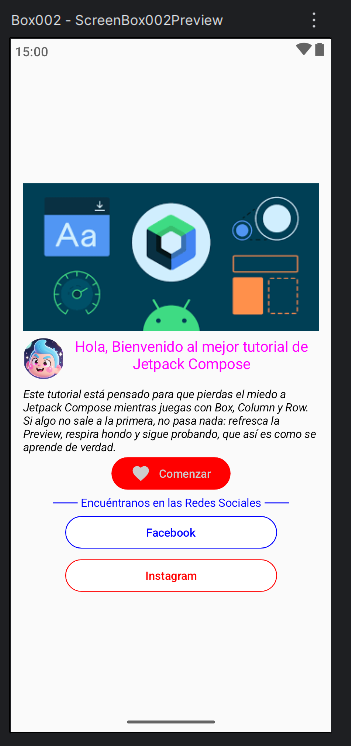

- [Necesitaras esta imagen compose_header.png](../tema-02/resource/compose_header.png)
- [Necesitaras esta imagen avatar.png](../tema-02/resource/avatar.png)

**Solución:**

<br/>

> 👉 [Ver código de la solución del ejercicio](../../src/tema-02/ejercicio-02/MainActivity.kt)👈

<br/>

- **Explicacion Paso a paso:**

> **Preparamos el proyecto:**

1. Abrimos **Android Studio** y creamos un nuevo proyecto.
2. Seleccionamos la plantilla **Empty Compose Activity**.
3. Nombramos nuestro proyecto: `Box002`.
4. Abrimos `MainActivity.kt`.
5. Limpiamos todo el código que genera Android Studio, dejando solo la línea del paquete:

```kotlin
    package com.example.box002
```

Ahora estamos listos para empezar desde cero.

<br/>

> 👉 **Creamos nuestro Composable principal:** En **Jetpack Compose**, todo lo que se dibuja en pantalla se hace dentro de una **función composable**, que se anota con **@Composable**.

Vamos a crear nuestro **composable principal** para esta pantalla:

```kotlin
    import androidx.compose.runtime.Composable

    // Este es nuestro composable principal, que luego irá lleno de contenido
    @Composable
    fun ScreenBox002() {
        // Aquí iremos agregando los elementos paso a paso
    }
```

**@Composable**: indica que la función puede dibujar UI en pantalla.
**ScreenBox002()**: es el nombre de nuestro composable, puedes ponerle cualquier nombre descriptivo.

Por ahora, la función está vacía. Más adelante añadiremos imágenes, textos y botones.

<br/>

> 👉 **Creamos la Preview**

Para ver los cambios mientras desarrollamos, usamos un **composable de Preview**. Esto nos permite ver la **UI** en el editor de Android Studio sin tener que correr la app en un emulador o dispositivo físico.

Vamos a crear un **preview** para nuestro **ScreenBox002()**:

```kotlin

    import androidx.compose.ui.tooling.preview.Preview

    // Preview para ver nuestro composable en Android Studio
    @Preview(
        name = "Box002", // Nombre que aparecerá en la Preview
        showSystemUi = true // Muestra la UI completa incluyendo la barra de estado y navegación
    )
    @Composable
    fun ScreenBox002Preview(){
        ScreenBox002() // Llamamos a nuestro composable principal para que se muestre
    }
```

**@Preview**: indica que esta función sirve solo para previsualizar un composable.
**name = "Box002"**: le da un nombre a la **Preview**, útil si tenemos varias previsualizaciones.
**showSystemUi = true**: hace que la Preview muestre toda la pantalla, incluyendo barra de estado y navegación, para ver cómo se verá la app completa.
**ScreenBox002Preview():** dentro llamamos a nuestro composable principal, de esta manera, cualquier cambio que hagamos en ScreenBox002() se reflejará automáticamente en la Preview.

<br/>

> 👉 **Cómo funciona la Preview:** Ahora que tenemos nuestro composable y la Preview. Cada vez que modifiquemos **ScreenBox002()**, la Preview se actualizará automáticamente. Nos permite ver el progreso de la UI paso a paso sin necesidad de ejecutar la app. Es ideal para practicar y experimentar con distintos layouts y elementos visuales.

El Código completo hasta ahora

```kotlin
    package com.example.box002

    import androidx.compose.runtime.Composable
    import androidx.compose.ui.tooling.preview.Preview

    // Composable principal de nuestra pantalla
    @Composable
    fun ScreenBox002() {
        // Aquí añadiremos los elementos de la pantalla (imagen, textos, botones)
    }

    // Preview para ver nuestro composable
    @Preview(
        name = "Box002",
        showSystemUi = true
    )
    @Composable
    fun ScreenBox002Preview() {
        ScreenBox002() // Llama al composable principal
    }
```

<br/>

> 👉 **Ver la Preview en Android Studio:** Una vez que hemos creado nuestro `@Composable` y su correspondiente `@Preview`, es importante saber **cómo visualizarla correctamente en Android Studio**.

Para ver la Preview:

1. Dirígete a la **parte superior derecha** del editor de código.
2. Pulsa sobre la opción **Split**.

Esto dividirá la pantalla en dos:

- A la **izquierda**, el código.
- A la **derecha**, la Preview de nuestra UI.

De esta forma podremos ir **programando y viendo los cambios en tiempo real**, lo cual es una de las grandes ventajas de Jetpack Compose.

<br/>

> 👉 **¿No aparece la Preview?**

A veces la Preview no se muestra automáticamente. Si esto ocurre:

- Pulsa el botón **Refresh** (icono de recarga 🔄) que aparece en la ventana de la Preview.

Esto fuerza a Android Studio a volver a renderizar la interfaz y mostrar los últimos cambios.

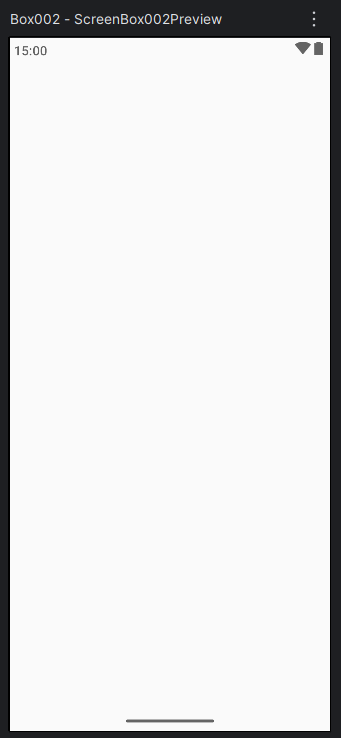

Gracias a la Preview podemos:

- Ver cómo queda nuestra pantalla sin ejecutar la app.
- Detectar errores visuales rápidamente.
- Experimentar con Box, Column, imágenes, textos y botones de forma mucho más cómoda.

A partir de ahora, **cada cambio que hagamos en `ScreenBox002()` se reflejará directamente en la Preview**, lo que nos permitirá avanzar paso a paso en el diseño de nuestra pantalla.

<br/>

> 👉 **Creamos el contenedor principal: Box**

Si observamos (o intuimos) el diseño final que queremos construir, nos damos cuenta de algo importante:

**Todos los componentes de la pantalla están contenidos dentro de un solo contenedor principal**, y dentro de este se organizan de forma vertical.

En **Jetpack Compose**, una muy buena forma de hacer esto es usando un **Box** como contenedor raíz y, dentro de él, una **Column** para ordenar los elementos uno debajo del otro.

<br/>

> 👉 **🧱 ¿Por qué usar Box?**

- `Box` es un contenedor flexible.
- Nos permite superponer elementos si lo necesitamos más adelante.
- Es ideal como contenedor principal que ocupa toda la pantalla.

<br/>

> 👉 **Añadimos el Box dentro de `ScreenBox002()`**

Vamos ahora a modificar nuestro composable principal `ScreenBox002()` y añadir un `Box`.

Dentro de la función escribimos lo siguiente:

```kotlin
    @Composable
    fun ScreenBox002() {
        Box() {
            // Aquí irá todo el contenido de la pantalla
        }
    }
```

Al escribir Box, Android Studio lo marcará en rojo. Esto es normal, significa que debemos importar el Box correcto de Jetpack Compose.

Importamos:

```kotlin
    import androidx.compose.foundation.layout.Box
```

<br/>

> 👉 **Hacemos que el Box ocupe toda la pantalla**

Nuestro contenedor Box debe ocupar todo el ancho y alto de la pantalla, ya que será el contenedor principal de la UI.

Para eso usamos un **Modifier** con **fillMaxSize()** de la siguiente forma:

```kotlin
    @Composable
    fun ScreenBox002() {
        Box(
            modifier = Modifier.fillMaxSize()
        ) {
            // Aquí irá todo el contenido de la pantalla
        }
    }
```

📦 Importaciones necesarias: Al usar **Modifier y fillMaxSize()**, Android Studio nos pedirá que importemos lo siguiente:

```kotlin
    import androidx.compose.ui.Modifier
    import androidx.compose.foundation.layout.fillMaxSize
```

**⚠️ Importante:** Asegúrate de importar siempre los componentes desde los paquetes de Jetpack Compose y no desde otros paquetes incorrectos. Android Studio normalmente sugiere el correcto, pero es bueno revisarlo.

<br/>

> 👉 **🔍 ¿Qué hemos logrado hasta ahora?**

Creamos un Box como contenedor principal. El Box ocupa toda la pantalla gracias a Modifier.fillMaxSize(). Todavía no se ve nada en la Preview, pero ya tenemos la base estructural de nuestra pantalla.

Esto es completamente normal: Primero construimos la estructura, luego el contenido.

<br/>

> 👉 **Centramos todo el contenido dentro del Box:**

Si observamos bien el diseño que queremos construir, notamos algo importante. **Todo el contenido de la pantalla está centrado**.

Como nuestro `Box` es el contenedor principal y ocupa toda la pantalla, podemos aprovechar una de sus grandes ventajas: el parámetro **contentAlignment**.

<br/>

> 👉 **🎯 ¿Qué es contentAlignment ?**

- **contentAlignment** indica **cómo se posiciona el contenido dentro del contenedor Box**.
- Al usar `Alignment.Center`, todo lo que esté dentro del `Box` se centrará automáticamente:
  - Horizontalmente
  - Verticalmente

Esto nos ahorra tener que centrar cada elemento individualmente.

<br/>

> 👉 **Añadimos `contentAlignment` al Box**

Modificamos nuestro contenedor `Box` de la siguiente forma:

```kotlin
    @Composable
    fun ScreenBox002() {
        Box(
            modifier = Modifier.fillMaxSize(),
            contentAlignment = Alignment.Center
        ) {
            // Todo lo que pongamos aquí dentro se centrará automáticamente
        }
    }
```

**📦 Importaciones necesarias:** Al usar Alignment.Center, Android Studio nos pedirá que importemos.

```kotlin
    import androidx.compose.ui.Alignment
```

<br/>

> 👉 **🔍 ¿Qué cambia ahora?**

Todo el contenido que coloquemos dentro del contenedor de tipo Box aparecerá centrado. No importa si luego añadimos una Column, imágenes, textos o botones: todo quedará centrado automáticamente dentro de la pantalla.

Nuestra UI empieza a tomar forma incluso antes de añadir los componentes visibles.

<br/>

> 👉 **Ahora agregamos una Column dentro del Box:**

Si analizamos bien la estructura de nuestra pantalla, nos damos cuenta de algo clave:

**Todo el contenido está organizado de arriba hacia abajo**.

Por ejemplo:

- Arriba del todo hay una imagen.
- Debajo hay una fila con una imagen y un texto.
- Luego otro texto.
- Luego botones, títulos, etc.

Esto nos indica claramente que necesitamos una **Column**, ya que `Column` organiza los elementos **uno debajo del otro** de forma vertical.

<br/>

> 👉 **Creamos la Column dentro del Box**

Dentro del `Box`, añadimos una `Column`:

```kotlin
    @Composable
    fun ScreenBox002() {
        Box(
            modifier = Modifier.fillMaxSize(),
            contentAlignment = Alignment.Center
        ) {
            Column() {
                // Aquí irán los componentes uno debajo del otro
            }
        }
    }
```

Al escribir **Column**, Android Studio lo marcará en rojo, lo que significa que debemos importar:

```kotlin
    import androidx.compose.foundation.layout.Column
```

> 👉 **Continuamos ajustando el tamaño de la Column:**

No queremos que la Column ocupe toda la pantalla, solo necesitamos que ocupe todo el ancho, y que su altura se adapte al contenido.

Por eso añadimos el siguiente modificador:

```kotlin
    Column(
        modifier = Modifier.fillMaxWidth()
    ) {
        // Componentes de la pantalla
    }
```

Esto significa:

- **fillMaxWidth()** → ocupa todo el ancho de la pantalla.

La altura se ajusta automáticamente al contenido.

También necesitamos importar:

```kotlin
    import androidx.compose.foundation.layout.fillMaxWidth
```

<br/>

> 👉 **Añadimos el primer componente: una Image**

Ahora empezamos a añadir contenido real. El primer componente será una imagen situada en la parte superior. En Jetpack Compose, las imágenes se muestran usando el composable **Image**.

Prácticamente todo en **Jetpack Compose** es un **composable**, y Image no es la excepción.

<br/>

> 👉 **Atributos obligatorios de Image**

El composable Image nos exige dos parámetros obligatorios:

- **painter →** indica qué imagen se va a cargar.
- **contentDescription →** descripción de la imagen (importante para accesibilidad).

<br/>

> 👉 **Cargamos una imagen desde drawable**

Para cargar una imagen local, usamos:

```kotlin
    painter = painterResource(id = ...)
```

Esto indica que la imagen se obtiene desde los recursos del proyecto.

**📁 ¿Dónde van las imágenes?**

Las imágenes deben estar en la carpeta:

```bash
    res/drawable
```

Para este ejercicio: Descargamos la siguiente imagen


La copiamos y pegamos dentro de la carpeta drawable.

<br/>

> 👉 **Accedemos a la imagen con la clase R**

Para acceder a los recursos usamos la clase R.

La imagen se referencia así:

```kotlin
    R.drawable.compose_header
```

⚠️ Nota: No se escribe .png al final. Android genera automáticamente esta referencia.

<br/>

> 👉 **Entonces ya podemos añadir la Image dentro de la Column**

Ahora sí, añadimos la imagen dentro de la Column:

```kotlin
    Column(
        modifier = Modifier.fillMaxWidth()
    ) {
        Image(
            painter = painterResource(id = R.drawable.compose_header),
            contentDescription = "Compose Header"
        )
    }
```

📦 Importaciones necesarias, Android Studio nos pedirá importar:

```kotlin
    import androidx.compose.foundation.Image
    import androidx.compose.ui.res.painterResource
```

Y también la clase R:

```kotlin
    import com.example.box002.R
```

🔄 Problema común: la imagen no aparece cuando agregamos una imagen al preview.

Si la imagen no se carga o aparece un error.

Ve a la parte superior derecha de Android Studio y pulsa Refresh 🔄. Justo encima de la ventana del preview.

Esto suele pasar porque Android Studio a veces no detecta automáticamente las imágenes nuevas en drawable. Después de refrescar, la Preview debería mostrar la imagen correctamente.

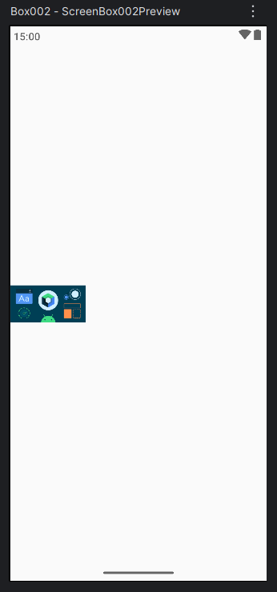

- Hasta ahora, nuestro **ScreenBox002()** se ve así:

```kotlin
    @Composable
    fun ScreenBox002() {
        Box(
            modifier = Modifier.fillMaxSize(),
            contentAlignment = Alignment.Center
        ) {
            Column(
                modifier = Modifier.fillMaxWidth()
            ) {
                Image(
                    painter = painterResource(id = R.drawable.compose_header),
                    contentDescription = "Compose Header"
                )
            }
        }
    }
```

<br/>

> 👉 **Ajustamos el tamaño y la posición de la Image**

Ahora que ya vemos la imagen en pantalla, nos damos cuenta de varias cosas:

- La imagen se ve **bastante pequeña**.
- Queremos que:
  - Ocupe todo el ancho disponible.
  - Tenga una altura definida.
  - Esté bien colocada visualmente.

En Jetpack Compose, al igual que `Box` y `Column`, **`Image` también acepta modificadores**, ya que es un composable más.

<br/>

> 👉 **Modificando el tamaño de la Image**

Vamos a añadir un `Modifier` a la `Image` para:

- Ocupar todo el ancho de la pantalla.
- Tener una altura fija de `200.dp`.

El código queda así:

```kotlin
    Image(
        painter = painterResource(id = R.drawable.compose_header),
        contentDescription = "Compose Header",
        modifier = Modifier
            .fillMaxWidth()
            .height(200.dp)
    )
```

**📏 Unidades de medida en Compose**

Es importante recordar:

- **dp →** se usa para tamaños, márgenes, paddings, alturas, anchos, etc.
- **sp →** se usa exclusivamente para texto (tamaño de fuente).

Todo lo que no sea texto, usa dp.

📦 Importaciones necesarias: Al usar height y dp, Android Studio nos pedirá importar:

```kotlin
    import androidx.compose.foundation.layout.height
    import androidx.compose.ui.unit.dp
```

Con estos cambios: La imagen ahora ocupa todo el ancho. Tiene una altura visible y clara. Se ve mucho mejor en la Preview.

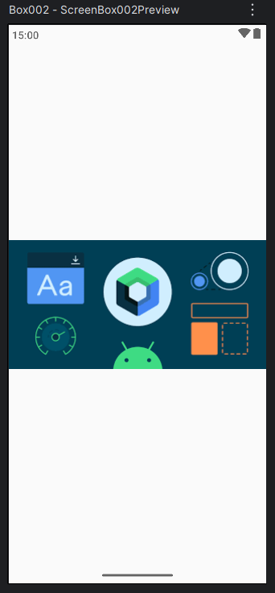

<br/>

> 👉 **Tenemos que añadir padding al contenedor principal**

Si observamos el diseño del ejercicio, notamos que: La imagen tiene espacio alrededor. Los demás componentes también necesitan ese mismo espacio. No queremos que el contenido quede pegado a los bordes de la pantalla.

En **Jetpack Compose** no existe el concepto de **margin** como tal. Todo se trabaja con **padding**.

**Aplicamos padding al Box**

Como el Box es el contenedor principal, lo más lógico es aplicar el padding ahí, para que todos los componentes internos se beneficien de él.

Modificamos el Box de esta forma:

```kotlin
    Box(
        modifier = Modifier
            .fillMaxSize()
            .padding(15.dp),
        contentAlignment = Alignment.Center
    ) {
        // Contenido
    }
```

📦 Importación necesaria.

Este ejercicio al ser uno de los primeros del tutorial te estoy remarcando todas las importaciones, pero hay que coger el hábito de importar a medida que te lo vaya indicando Android Studio.

```kotlin
    import androidx.compose.foundation.layout.padding
```

**🔍 ¿Qué logramos con esto?**

Todo el contenido tiene un espacio interno uniforme. La UI se ve más limpia y profesional. No necesitamos añadir padding individual a cada componente (por ahora).

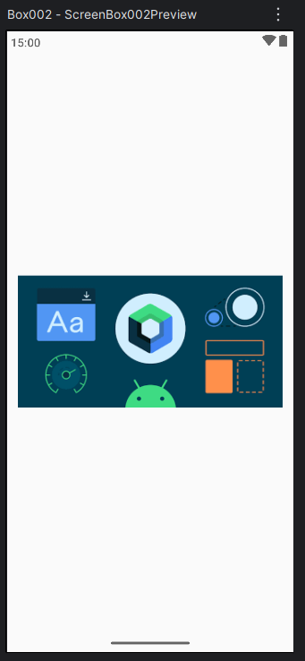

**Estado actual del código:** Así queda nuestro ScreenBox002() hasta este punto

```kotlin
    @Composable
    fun ScreenBox002() {
        Box(
            modifier = Modifier
                .fillMaxSize()
                .padding(15.dp),
            contentAlignment = Alignment.Center
        ) {
            Column(
                modifier = Modifier.fillMaxWidth(),
                horizontalAlignment = Alignment.CenterHorizontally
            ) {
                Image(
                    painter = painterResource(id = R.drawable.compose_header),
                    contentDescription = "Compose Header",
                    modifier = Modifier
                        .fillMaxWidth()
                        .height(200.dp)
                )
            }
        }
    }
```

<br/>

> 👉 **Continuamos agregando una fila (Row) con avatar y texto**

Si seguimos observando el diseño del ejercicio, vemos que **debajo de la imagen principal** aparece una nueva sección:

Una **fila** con:

- **A la izquierda:** una imagen pequeña en forma circular (avatar).
- **A la derecha:** un texto.

Aquí es donde empezamos a **combinar contenedores**, algo fundamental en Jetpack Compose:

- `Box` como contenedor principal
- `Column` para organizar verticalmente
- `Row` para organizar horizontalmente

Este ejercicio es muy bueno para entender cómo se combinan entre sí.

<br/>

> 👉 **Creamos la Row debajo de la Image**

Dentro de la `Column`, justo debajo de la imagen principal, añadimos una `Row`:

```kotlin
    Row() {
        // Avatar y texto irán aquí
    }
```

Al escribir **Row**, Android Studio lo marcará en rojo, lo cual nos recuerda algo importante:

Siempre que uses un nuevo composable, debes importar su paquete. Importamos ahora lo siguiente:

```kotlin
    import androidx.compose.foundation.layout.Row
```

<br/>

> 👉 **Añadimos la imagen del avatar**

Al igual que hicimos antes con la imagen principal, necesitamos:

Copiar la imagen avatar.png.


Pegarla en la carpeta:

```bash
    res/drawable
```

Luego, dentro de la Row, añadimos la imagen:

```kotlin
    Row {
        Image(
            painter = painterResource(id = R.drawable.avatar),
            contentDescription = "Avatar"
        )
    }
```

Como ya sabemos, es posible que la **Preview** no se refresque automáticamente al añadir una nueva imagen.

Si no aparece la imagen: Ve arriba a la derecha y pulsa **Refresh** 🔄

Después de eso, deberías ver el avatar debajo de la imagen principal.

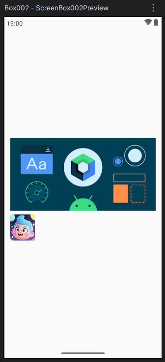

<br/>

> 👉 **Ahora agregamos el texto al lado del avatar**

Como estamos dentro de una Row, todo lo que pongamos se colocará uno al lado del otro.

Añadimos un **Text** justo después de la imagen:

```kotlin
    Row {
        Image(
            painter = painterResource(id = R.drawable.avatar),
            contentDescription = "Avatar"
        )

        Text(
            text = "Bienvenido al mejor curso de Jetpack Compose"
        )
    }
```

Android Studio nos pedirá importar:

```kotlin
    import androidx.compose.material3.Text
```

Con esto ya tenemos: Imagen a la izquierda y texto a la derecha

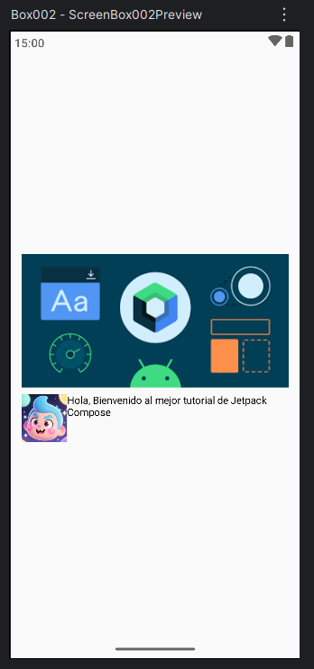

Pero todavía no se ve como queremos.

<br/>

> 👉 **Tenemos que ajustar la imagen del avatar (tamaño y forma circular)**

Ahora vamos a mejorar el avatar.

📐 Cambiamos el tamaño: Le damos un tamaño fijo de 50.dp

```kotlin
    Modifier.size(50.dp)
```

🔵 Hacemos la imagen que sea circular. Para que la imagen sea circular, usamos:

```kotlin
    .clip(CircleShape)
```

El código completo de la imagen queda así:

```kotlin
    Image(
        painter = painterResource(id = R.drawable.avatar),
        contentDescription = "Avatar",
        modifier = Modifier
            .size(50.dp)
            .clip(CircleShape)
    )
```

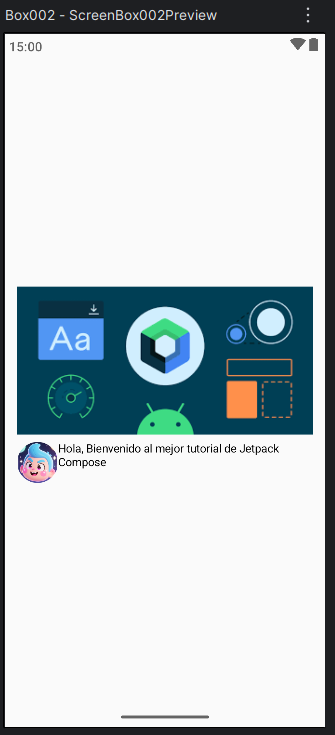

📦 Importaciones necesarias. Habra algunas importaciones que no haya puesto, pero es lo mismo siempre importamos cuando salga en rojo. Si hay varias opciones como estamos trabajando con compose, usa esa opción.

```kotlin
    import androidx.compose.foundation.layout.size
    import androidx.compose.foundation.shape.CircleShape
    import androidx.compose.ui.draw.clip
```

<br/>

> 👉 **¿Y si la imagen no queda bien circular?**

Si usas otra imagen y ves que: No se ve completamente circular o se deforma. Es porque el ancho y el alto de la imagen no coinciden.

Para solucionarlo, usamos:

```kotlin
    contentScale = ContentScale.Crop
```

Ejemplo:

```kotlin
    Image(
        painter = painterResource(id = R.drawable.avatar),
        contentDescription = "Avatar",
        contentScale = ContentScale.Crop,
        modifier = Modifier
            .size(50.dp)
            .clip(CircleShape)
    )
```

En nuestro caso no es necesario, pero es muy bueno saberlo.

Importación:

```kotlin
    import androidx.compose.ui.layout.ContentScale
```

<br/>

> 👉 **Para finalizar la fila, ajustamos el texto de la Row**

Ahora trabajamos el texto.

🎯 Para centrar el texto
Usamos:

```kotlin
    textAlign = TextAlign.Center
```

🎨 Estilizamos el texto. Para darle estilo usamos **TextStyle**, que no es un composable, sino una clase.

Con TextStyle podemos: Cambiar tamaño - Color - Negrita - Subrayado, etc.

Ejemplo:

```kotlin
    Text(
        text = "Bienvenido al mejor curso de Jetpack Compose",
        textAlign = TextAlign.Center,
        style = TextStyle(
            fontSize = 18.sp,
            color = Color.Magenta
        )
    )
```

📦 Importaciones necesarias

```kotlin
    import androidx.compose.ui.text.TextStyle
    import androidx.compose.ui.text.style.TextAlign
    import androidx.compose.ui.unit.sp
    import androidx.compose.ui.graphics.Color
```

Deberiamos obtener esta preview:

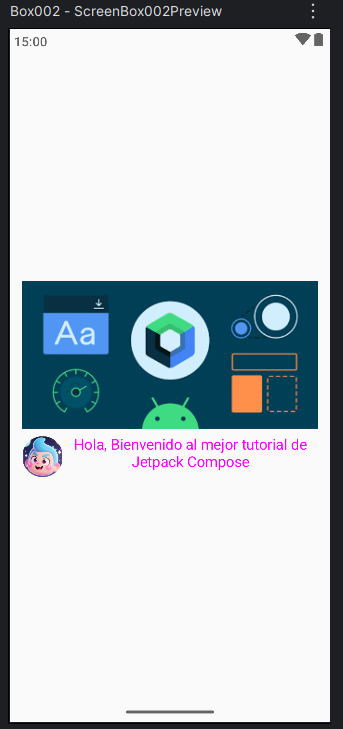

<br/>

> 👉 **Agregamos un texto debajo de la Row**

Si seguimos bajando en el diseño, vemos que **debajo de la fila (Row)** aparece un texto adicional.

Este texto funciona como un **subtítulo o pequeño párrafo explicativo**, por lo que:

- Será más pequeño que el texto anterior.
- No necesita estar centrado.
- Tendrá un estilo diferente (itálica).

**Añadiendo el Text debajo de la Row**

Justo después del `Row`, añadimos un `Text`:

```kotlin
Text(
    text = "Este tutorial está pensado para que pierdas el miedo a Jetpack Compose mientras juegas con Box, Column y Row. Si algo no sale a la primera, no pasa nada: refresca la Preview, respira hondo y sigue probando, que así es como se aprende de verdad.",
    style = TextStyle(
        fontSize = 14.sp,
        color = Color.Black,
        fontStyle = FontStyle.Italic
    )
)
```

📌 Detalles importantes de este Text

- **fontSize = 14.sp** → Usamos un tamaño más pequeño porque es un subtítulo o texto secundario.
- **color = Color.Black**
- **fontStyle = FontStyle.Italic** → Le damos un estilo itálico para diferenciarlo visualmente del texto principal.
- **No usamos TextAlign** → Por defecto, el texto se alinea a la izquierda (Start), así que no es necesario añadir:

```kotlin
    textAlign = TextAlign.Left
```

Evitamos código innecesario.

📦 Importaciones necesarias

```kotlin
    import androidx.compose.ui.text.font.FontStyle
```

Tenemos la siguiente Preview:

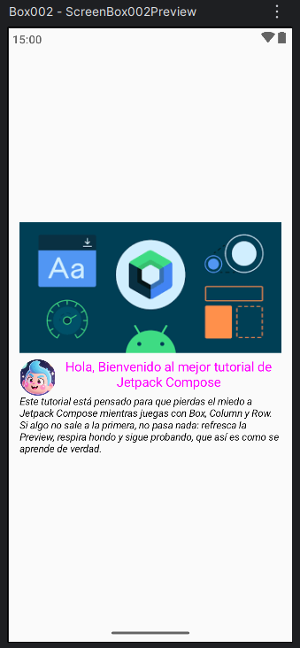

<br/>

> 👉 **Separamos la Row del Text con Spacer**

Al ver la Preview, notamos que: El Row y el Text están demasiado pegados.

Para solucionar esto, usamos otro composable muy importante en Compose: **Spacer**.

**Spacer** sirve para: Crear espacio entre componentes. Controlar separaciones sin usar márgenes (que no existen en Compose).

<br/>

> 👉 **Añadimos el Spacer**

Entre el Row y el Text, añadimos:

```kotlin
    Spacer(
        modifier = Modifier.height(10.dp)
    )
```

📦 Importaciones necesarias

```kotlin
    import androidx.compose.foundation.layout.Spacer
```

**Código de esta sección completo**

Así queda ahora esta parte dentro de la Column:

```kotlin
    Row {
        Image(
            painter = painterResource(id = R.drawable.avatar),
            contentDescription = "Avatar",
            modifier = Modifier
                .size(50.dp)
                .clip(CircleShape)
        )

        Text(
            text = "Bienvenido al mejor curso de Jetpack Compose",
            textAlign = TextAlign.Center,
            style = TextStyle(
                fontSize = 18.sp,
                color = Color.Black
            )
        )
    }

    Spacer(
        modifier = Modifier.height(10.dp)
    )

    Text(
        text = "Este tutorial está pensado para que pierdas el miedo a Jetpack Compose mientras juegas con Box, Column y Row. Si algo no sale a la primera, no pasa nada: refresca la Preview, respira hondo y sigue probando, que así es como se aprende de verdad.",
        style = TextStyle(
            fontSize = 14.sp,
            color = Color.Black,
            fontStyle = FontStyle.Italic
        )
    )
```

<br/>

> 👉 **Lo siguiente es agregar un botón debajo del texto**

Ya casi terminamos. Si seguimos el diseño, vemos que **debajo del texto descriptivo** aparece un botón.

En Jetpack Compose tenemos varios tipos de botones:

- `Button` → el botón clásico.
- `OutlinedButton` / `OutlinedIconButton` → botones con borde.
- `TextButton` → un texto que actúa como botón (muy útil para enlaces).

En este ejercicio vamos a usar el **`Button` clásico**.

<br/>

> 👉 **¿Cómo funciona Button?**

Si miramos la documentación de `Button`, veremos algo muy interesante:

- **`Button` acepta otros `@Composable` dentro de sus llaves**.

Esto significa que:

- Dentro de un botón podemos poner un `Text`
- O un `Icon`
- O un `Row`
- O un `Column` ...
- O una combinación de todo

Esto nos da muchísima flexibilidad.

<br/>

> 👉 **Agregamos el botón básico con texto**

El botón más simple sería así:

```kotlin
    Button(onClick = { }) {
        Text(text = "Comenzar")
    }
```

Con esto ya tenemos un botón funcional con texto.

<br/>

> 👉 **Botón con icono + texto**

Ahora pensemos un poco 🤔

¿Qué pasa si queremos un botón con un icono y un texto?

La idea es sencilla: Ponemos un Icon + un Text

```kotlin
    Button(onClick = { }) {
        Row {
            Icon(
                imageVector = Icons.Filled.Favorite,
                contentDescription = "Favorito"
            )
            Text(text = "Comenzar")
        }
    }
```

Aquí usamos:

- **Icon** → para mostrar iconos
- **Icons.Filled.Favorite** → icono de corazón de Material Design

📦 Importaciones necesarias

```kotlin
    import androidx.compose.material3.Button
    import androidx.compose.material3.Icon
    import androidx.compose.material3.Text
    import androidx.compose.material.icons.Icons
    import androidx.compose.material.icons.filled.Favorite
```

<br/>

> 👉 **Separamos el icono del texto con Spacer**

Si miramos la Preview, veremos que: El icono y el texto están demasiado pegados.

Solución: usar un **Spacer con ancho**.

```kotlin
    Spacer(modifier = Modifier.width(10.dp))
```

El botón quedaría así:

```kotlin
    Button(onClick = { }) {
        Row {
            Icon(
                imageVector = Icons.Filled.Favorite,
                contentDescription = "Favorito"
            )

            Spacer(modifier = Modifier.width(10.dp))

            Text(text = "Comenzar")
        }
    }
```

Nuestra Preview se vería asi:

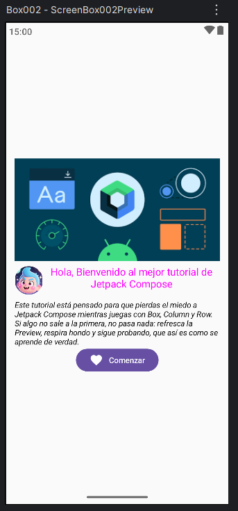

<br/>

> 👉 **Importante: Button ya trabaja como una Row**

Aquí viene un detalle muy importante de Compose 👀

- **Button** internamente ya se comporta como una **Row**.

Esto significa que:

No es obligatorio poner una **Row** dentro del **Button** si solo queremos icono + texto en horizontal.

Si ponemos una Row, estaríamos creando una Row dentro de otra Row, lo cual no es necesario.

Por lo tanto, podemos simplificar el botón eliminando la Row:

```kotlin
    Button(onClick = { }) {
        Icon(
            imageVector = Icons.Filled.Favorite,
            contentDescription = "Favorito"
        )

        Spacer(modifier = Modifier.width(10.dp))

        Text(text = "Comenzar")
    }
```

Mucho más limpio ✅

**¿Y si quiero el icono encima del texto?**

En ese caso sí tendría sentido usar una Column dentro del botón:

```kotlin
    Button(onClick = { }) {
        Column(horizontalAlignment = Alignment.CenterHorizontally) {
            Icon(
                imageVector = Icons.Filled.Favorite,
                contentDescription = "Favorito"
            )
            Text(text = "Comenzar")
        }
    }
```

Todo es cuestión de jugar con los contenedores.

<br/>

> 👉 **Centremos el botón en la pantalla**

Si añadimos el botón tal cual dentro de la Column principal, veremos que: Se alinea a la izquierda por defecto.

Queremos que el botón esté centrado horizontalmente.

Una solución muy clara es: Meter el Button dentro de un Box. Hacer que el Box ocupe todo el ancho y centrar su contenido.

**Box para centrar el Button**

```kotlin
    Box(
        modifier = Modifier.fillMaxWidth(),
        contentAlignment = Alignment.Center
    ) {
        Button(onClick = { }) {
            Icon(
                imageVector = Icons.Filled.Favorite,
                contentDescription = "Favorito"
            )

            Spacer(modifier = Modifier.width(10.dp))

            Text(text = "Comenzar")
        }
    }
```

<br/>

> 👉 **Ahora cambiamos el color de un Button**

En Jetpack Compose, el botón clásico (Button) acepta un parámetro llamado **colors**, que nos permite definir los colores del botón.

El más común es usar:

```kotlin
    colors = ButtonDefaults.buttonColors(
        containerColor = Color.Red,
        contentColor = Color.LigthGray
    )
```

- **containerColor** → color de fondo del botón.
- **contentColor** → color del contenido (texto e iconos) dentro del botón. Por defecto Compose lo ajusta automáticamente según el fondo.

El codigo será el siguiente:

```kotlin
    Box(
        modifier = Modifier.fillMaxWidth(),
        contentAlignment = Alignment.Center
    ) {
        Button(
            onClick = { /* Acción del botón */ },
            colors = ButtonDefaults.buttonColors(
                containerColor = Color.Red,
                contentColor = Color.LigthGray
            )
        ) {
            Icon(
                imageVector = Icons.Filled.Favorite,
                contentDescription = "Favorito"
            )
            Spacer(modifier = Modifier.width(10.dp))
            Text(text = "Comenzar")
        }
    }
```

La preview se ve asi:

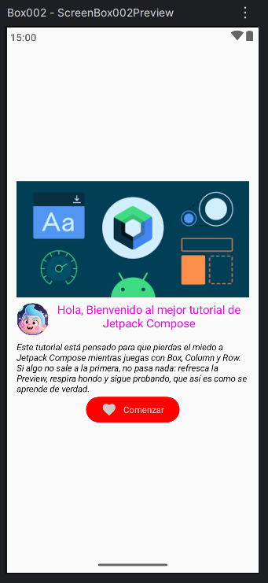

<br/>

> 👉 **Continuamos con una fila con línea + texto + línea**

Si seguimos el diseño, ahora nos encontramos con una sección muy típica en muchas apps:

**una línea, un texto en el centro y otra línea**

Algo como:

- ——— Encuéntranos en las Redes Sociales ———

Para esto, claramente necesitamos otro **Row**, ya que los elementos van en horizontal.

<br/>

> 👉 **Creamos una Row**

Debajo del botón anterior, añadimos un `Row`:

```kotlin
Row {
    // Aquí irán la línea, el texto y la línea
}
```

Como siempre, si **Row** se pone en rojo, recuerda importar:

```kotlin
    import androidx.compose.foundation.layout.Row
```

(Lo recalco mucho porque es un hábito muy importante cuando empiezas).

<br/>

> 👉 **Aquí usamos Divider para crear la línea**

Jetpack Compose tiene un composable llamado **Divider**, que sirve para crear líneas separadoras.

Vamos a usarlo como una rayita horizontal.

Ejemplo básico:

```kotlin
    Divider()
```

Pero así es muy pequeño y no se ve bien, así que vamos a personalizarlo.

Queremos: Un ancho de 30.dp, un grosor fino (1.dp) y color azul

El código queda así:

```kotlin
    Divider(
        modifier = Modifier.width(30.dp),
        thickness = 1.dp,
        color = Color.Blue
    )
```

**Añadiendo el texto entre las líneas**

Ahora añadimos el texto en color azul que irá en medio:

```kotlin
Text(
    text = "Encuéntranos en las Redes Sociales",
    color = Color.Blue
)
```

Separando el texto de las líneas con padding. Si miramos la Preview, veremos que:

Las líneas están demasiado pegadas al texto.

Solución: añadir padding al Text.

```kotlin
    Text(
        text = "Encuéntranos en las Redes Sociales",
        color = Color.Blue,
        modifier = Modifier.padding(4.dp)
    )
```

Esto añade espacio tanto a la izquierda como a la derecha del texto.

Ahora juntamos todo:

```kotlin
    Row {
        Divider(
            modifier = Modifier.width(30.dp),
            thickness = 1.dp,
            color = Color.Blue
        )

        Text(
            text = "Encuéntranos en las Redes Sociales",
            color = Color.Blue,
            modifier = Modifier.padding(4.dp)
        )

        Divider(
            modifier = Modifier.width(30.dp),
            thickness = 1.dp,
            color = Color.Blue
        )
    }
```

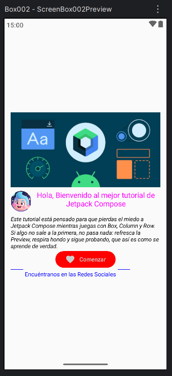

Visualmente ya tenemos: ✅ Línea ✅ Texto ✅ Línea

Pero todavía no está bien alineado.

<br/>

> 👉 **Corrigimos alineaciones en la Row**

Problemas que vemos: El texto no está perfectamente alineado con las líneas y todo el conjunto no está centrado en la pantalla.

Esto se soluciona usando los parámetros de la Row, alineando correctamente.
Modificamos la Row de esta forma:

```kotlin
    Row(
        modifier = Modifier.fillMaxWidth(),
        verticalAlignment = Alignment.CenterVertically,
        horizontalArrangement = Arrangement.Center
    ) {
        Divider(
            modifier = Modifier.width(30.dp),
            thickness = 1.dp,
            color = Color.Blue
        )

        Text(
            text = "Encuéntranos en las Redes Sociales",
            color = Color.Blue,
            modifier = Modifier.padding(4.dp)
        )

        Divider(
            modifier = Modifier.width(30.dp),
            thickness = 1.dp,
            color = Color.Blue
        )
    }
```

**¿Qué hace cada cosa aquí?**

- **fillMaxWidth() →** La Row ocupa todo el ancho de la pantalla.
- **verticalAlignment = Alignment.CenterVertically →** Alinea verticalmente las líneas y el texto, evitando que las líneas queden más arriba o más abajo.
- **horizontalArrangement = Arrangement.Center →** Centra todo el conjunto en la pantalla.

Resultado de la preview:

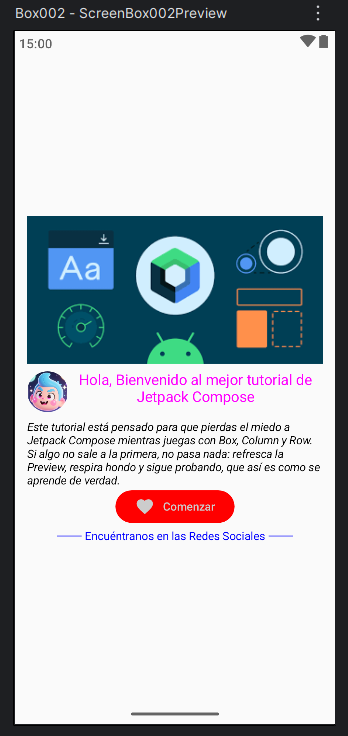

<br/>

> 👉 **Para finalizar el ejercicio ponemos los dos botones de las redes sociales: Facebook e Instagram.**

Tienen ambos botones fondo blanco. Facebook tiene color azul y borde azul. Instagram tiene color rojo y borde rojo.

Además: Ambos botones deben ser más anchos que el botón “Comenzar”.

**¿Qué tipo de botón usamos?**

Aquí NO nos conviene usar Button, porque: Button tiene fondo sólido por defecto. Cambiar borde + fondo blanco es más complicado.

- El botón perfecto aquí es **OutlinedButton**.

**¿Por qué OutlinedButton?**

Trae borde de forma natural. Fondo transparente (o blanco). Fácil de personalizar colores.

El ancho de los botones es aproximadamente el doble del ancho del botón Comenzar. En Compose, lo normal es: Definir un ancho fijo con **Modifier.width()** o usar **fillMaxWidth()** con un porcentaje.

Aquí vamos a usar un ancho fijo, por ejemplo:

```kotlin
    Modifier.width(260.dp)
```

<br/>

> 👉 **Botón de Facebook**

Código del botón Facebook

```kotlin
    OutlinedButton(
        onClick = { },
        modifier = Modifier.width(260.dp),
        border = BorderStroke(1.dp, Color.Blue),
        colors = ButtonDefaults.outlinedButtonColors(
            containerColor = Color.White,
            contentColor = Color.Blue
        )
    ) {
        Text(text = "Facebook")
    }
```

**¿Qué estamos haciendo aquí?**

- **OutlinedButton** → botón con borde
- **Modifier.width(260.dp)** → botón ancho
- **BorderStroke(1.dp, Color.Blue)** → borde azul
- **containerColor = Color.White** → fondo blanco
- **contentColor = Color.Blue** → texto azul

📦 Importaciones necesarias

```kotlin
    import androidx.compose.material3.OutlinedButton
    import androidx.compose.foundation.BorderStroke
```

<br/>

> 👉 **Separar los botones con Spacer**

Como los botones van uno debajo del otro, necesitamos espacio entre ellos:

```kotlin
    Spacer(modifier = Modifier.height(10.dp))
```

<br/>

> 👉 **Botón de Instagram**

El de Instagram es exactamente igual, solo cambiamos el color:

```kotlin
    OutlinedButton(
        onClick = { },
        modifier = Modifier.width(260.dp),
        border = BorderStroke(1.dp, Color.Red),
        colors = ButtonDefaults.outlinedButtonColors(
            containerColor = Color.White,
            contentColor = Color.Red
        )
    ) {
        Text(text = "Instagram")
    }
```

Nuestra preview es esta:

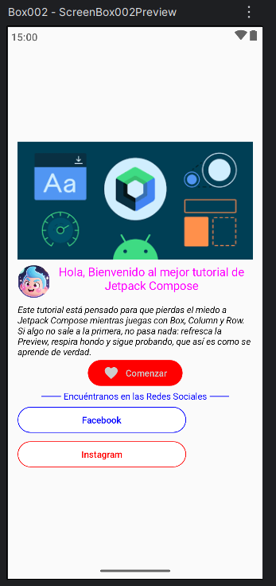

<br/>

> 👉 **Para finalizar el ejercicio centramos los dos botones**

Igual que hicimos antes, queremos que los botones estén centrados horizontalmente.

**¿Metemos los botones dentro de un contenedor Box o usamos el contenedor Column?.**

Si usamos un **Box** los botones se superponen uno encima del otro. Por eso mismo mejor usar una **Column**, donde cada elemento va uno debajo del otro.

```kotlin
    Column(
        modifier = Modifier.fillMaxWidth(),
        horizontalAlignment = Alignment.CenterHorizontally
    ) {
        Column(horizontalAlignment = Alignment.CenterHorizontally) {

            OutlinedButton(
                onClick = { },
                modifier = Modifier.width(260.dp),
                border = BorderStroke(1.dp, Color.Blue),
                colors = ButtonDefaults.outlinedButtonColors(
                    containerColor = Color.White,
                    contentColor = Color.Blue
                )
            ) {
                Text(text = "Facebook")
            }

            Spacer(modifier = Modifier.height(8.dp))

            OutlinedButton(
                onClick = { },
                modifier = Modifier.width(260.dp),
                border = BorderStroke(1.dp, Color.Red),
                colors = ButtonDefaults.outlinedButtonColors(
                    containerColor = Color.White,
                    contentColor = Color.Red
                )
            ) {
                Text(text = "Instagram")
            }
        }
    }
```

Con **modifier = Modifier.fillMaxWidth()** hacemos que la Column que contiene los botones ocupe el ancho de la pantalla. Y con **horizontalAlignment = Alignment.CenterHorizontally** centramos horizontalmente todos los componenetes que contiene la Column.

Tenemos el ejercicio resuelto, como muestra la siguiente Preview:


<br/><hr/><br/>

| [⬅️ Ir al ejercicio 1](../tema-02/ejercicio-01.md) | [⬆️ Ir al inicio del ejercicio 2](#ejercicio-2-practicando-con-contenedores-anidados) | [↩️ Volver al inicio del Proyecto](../../README.md) | [↩️ Volver al Capítulo 2](../../docs/02-contenedores.md) |
| :------------------------------------------------: | :-----------------------------------------------------------------------------------: | --------------------------------------------------- | -------------------------------------------------------- |
